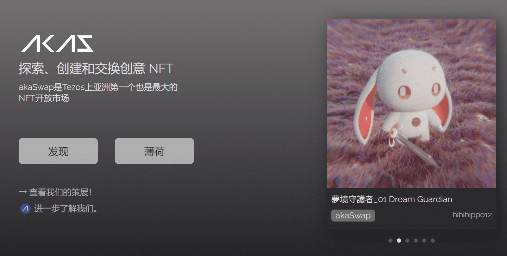
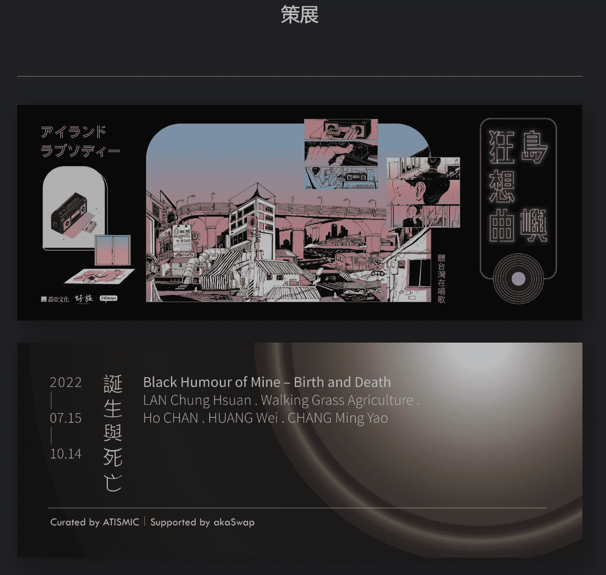
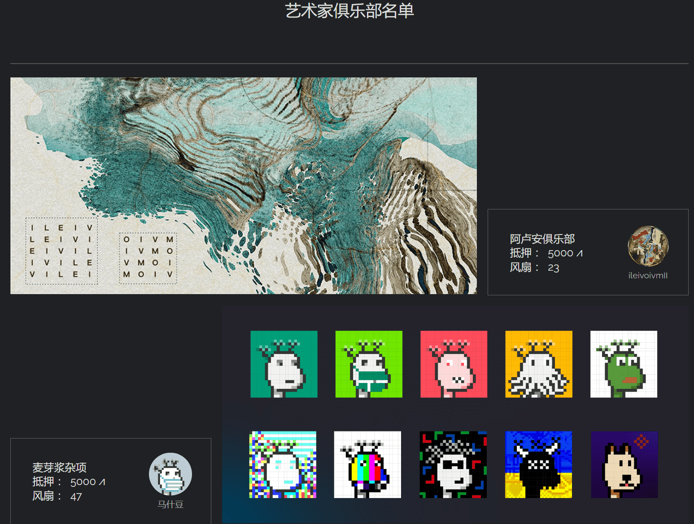
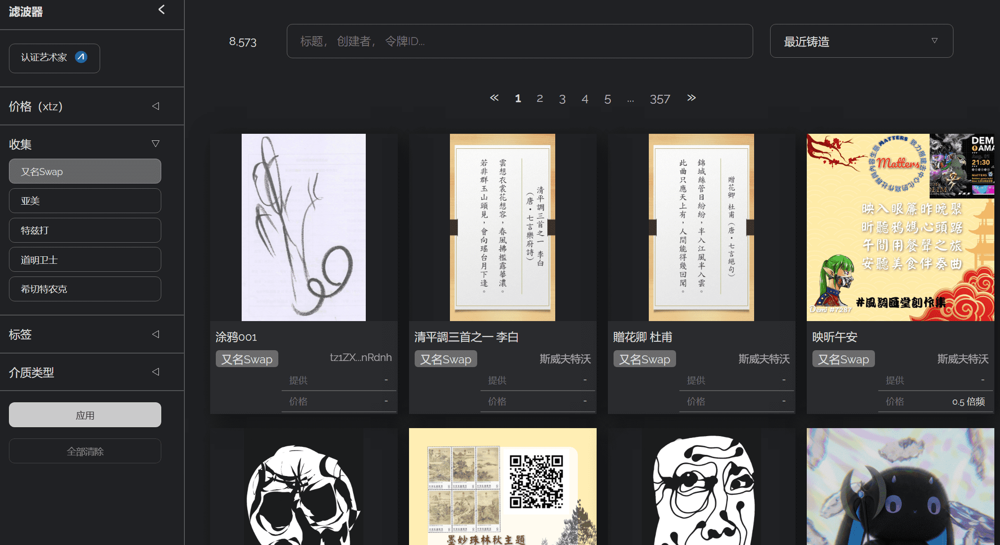

# akaSwap

> 我们致力于打造一个简单、友好、开放的绿色非营利性金融交易平台，让大家轻松创造、交易、欣赏、收藏和推广来自世界各地的各类非营利性金融有价值资产。
> akaSwap希望为艺术家开辟一个新的收入来源，并为收藏家提供一个储存和交易艺术品的场所。艺术家们可以拍卖他们的作品，或者以定制的价格出售。

**akaSwap是Tezos上亚洲第一个也是最大的NFT开放市场**

akaSwap 2022年2月於台灣成立，是亞洲第一個以「綠能區塊鏈Tezos」 為基礎的多功能藝術品交易平台，由一群長期在科技藝術領域進行創作、研究的團隊所組成，期待以新型態的交易方式，為藝術創作者創造新收益來源。

---

## 【什么是akaOBJ?】

akaOBJ是我们创造的一个词，指的是在akaSwap上铸造的NFT（不可替代的令牌），它可能有多种形式，例如图片，视频，声音，视觉艺术等。您可以在aksSwap上享受无限交易，同时还可以赚取akaDAO。

## 【什么是akaDAO？】

1. 在akaSwap上交易时获得的虚拟代币，用于为akaSwap创建经济周期。

   akaDAO是一个FA2令牌，最大发行量固定为1，000，000，其值可以分为6位小数。

2. 分配规则：akaDAO分五个阶段分配，每个阶段分配100，000个akaDAO。

   每笔交易后，akaDAO将按照一定的价格率向买家和发行人发行（任何单笔交易超过50xtz按50xtz计算）。

   上述速率随着阶段的进展而降低。

3. 为代币制作Gacha成本akaDAO。将来，我们还可能使用akaDAO作为特殊活动的门票。

   平台预留的akaDAO，未来也将作为奖励发放给大家。

---

## 关于akaSwap

