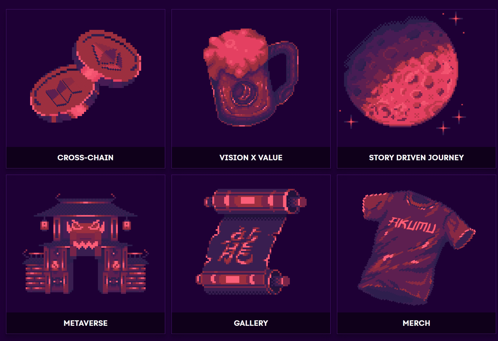

# Akumu Dragonz

室内室外，坐在火炉旁，享受一杯新鲜的BOKU。
拉起一把椅子，桌子上总是可以放另一张椅子。
外面的世界是人山人海，路过的陌生人。
但在这里你可以找到你的部落......

-------

## 宣言

预测未来的最好方法是创造它......

我们飞向不同的土地，书写新的篇章……

来吧，我们准备好了！

当别人曲折时，我们曲折，我们作为一个整体移动！

我们按照自己的节奏前进，我们的信念是正确的。

室内室外，坐在火炉旁，享受一杯新鲜的BOKU。

拉起一把椅子，桌子上总是可以放另一张椅子。

外面的世界是人山人海，路过的陌生人。

但在这里你可以找到你的部落...

进入漫长的夜晚……

BOKU 将酿造，现在和永远。

黑夜过后，黎明来临。

## 旅程

**跨链 WEB3 品牌**

利用 NFT 作为下一个前沿领域，通过虚拟和物理世界的参与发现品牌建设的无限潜力。

**身临其境的互动体验**

以一个植根于传说的故事开始任务，该故事提供了一条与神器一起收集的进展路径。

**奖励支持者和社区**

在此体验的整个生命周期中，通过解锁利益和奖励收藏家，持续向我们的持有者回馈价值。

**正玩得开心**

这真的需要任何解释吗？

## 总体规划

**跨链社区**

> Dragonz一直是一个跨链项目
>
> 未来是多链的
>
> NFT 是品牌建设、筹款、社区建设等等的未来......
>
> 我们的目标是通过 Boku Labs 旗下的一个数字品牌将来自所有连锁店的全球持有者和粉丝联合起来。
>
> Akumu Dragonz 让您接触到 Solana 上最强大的社区之一，拥有一个 1 级开发团队，为持有者带来最大价值。
>
> 我们的路线图将推动我们所有的 NFT 一起向前发展：ETH 和 SOL。
>
> 我们早
>
> 我们是 Solana 上第一个在 The Sandbox Game 中购买土地并与 MetaVenture 工作室合作的项目。
>
> 现在我们已经建立了第一个真正的跨链铸币厂。
>
> 我们相信跨链 NFT 项目将在不远的将来成为常态，并为能够走在最前沿而感到自豪。

**愿景 x 价值**

> Akumu Dragonz 团队是一个自筹资金的个人团体，希望对 Web3 文化产生持久的影响。
>
> 我们相信...
>
> - NFT 技术处于早期阶段，将成为筹款、社区建设和品牌推广的关键。
> - 在多链的未来，不可知链的品牌吸引了观众……
> - 高质量的数字体验和 IRL 体验以及乐趣是 NFT 项目成功的关键要素。
>
> 最重要的是，我们相信做从未做过的事情。
>
> 我们是潮流引领者，而不是潮流追随者。

**故事驱动的旅程**

> 您的 Akumu Dragon 是史诗般旅程的主角。 与我们一起踏上游戏化和互动的故事情节，您的决定会产生影响。 这不是一个你是乘客的世界，你是自己的船长。
>
> 通过锻造收集碎片，交易它们，为战争做准备……
> 我们将强大的故事讲述与与我们的高分辨率像素艺术交织在一起的主题相结合。 我们首先是创意者，并将重新定义在知识、理论制定和与持有者互动方面的可能性。
>
> 专业通过专业...
> 谨慎选择你的交易，没有回头路。 制作独特的物品。 成为你的手艺大师。
>
> 学习祖传魔法...
> 只有贤者才能供养母母……

**元界**

> 沙盒游戏
> 几个月来，我们一直在为我们的 Solana 系列默默地构建沙盒游戏。
>
> 随着我们对 Bōryoku Dragonz 的初步构建接近完成，我们将评估如何为我们的持有者创造最身临其境和高质量的元宇宙体验。
>
> Discord 环聊是 Web 3 文化的早期代表，但社区将迁移到更广阔的空间，来自各种收藏的可组合资产可以在其中构建他们的愿景。
>
> Dragonz 敏锐地意识到这一趋势，并有能力实现它......

**画廊**

> 我们的高分辨率艺术在区块链上突破了像素艺术的极限，具有线条艺术的细节和像素的老派感觉。
>
> 我们是创纪录的...
> 我们计划在世界上最大的画廊和展览中展示我们的艺术。
>
> 我们将继续创新并展示独特且前所未见的设计。

**商品**

> 我们相信高质量的在线体验和 IRL 体验，并利用我们与顶级奢侈品牌的联系，打造专属于持有者的合作。
>
> Dragonz 商品不仅适用于加密和 NFT 活动。
> 您将拥有全年代表 Dragonz 的装备：
>
> - 街头服饰
> - 休闲装
> - 运动装
> - 多得多...
>
> Merch 是我们品牌的核心，也是我们计划奖励持有者的方式之一。
