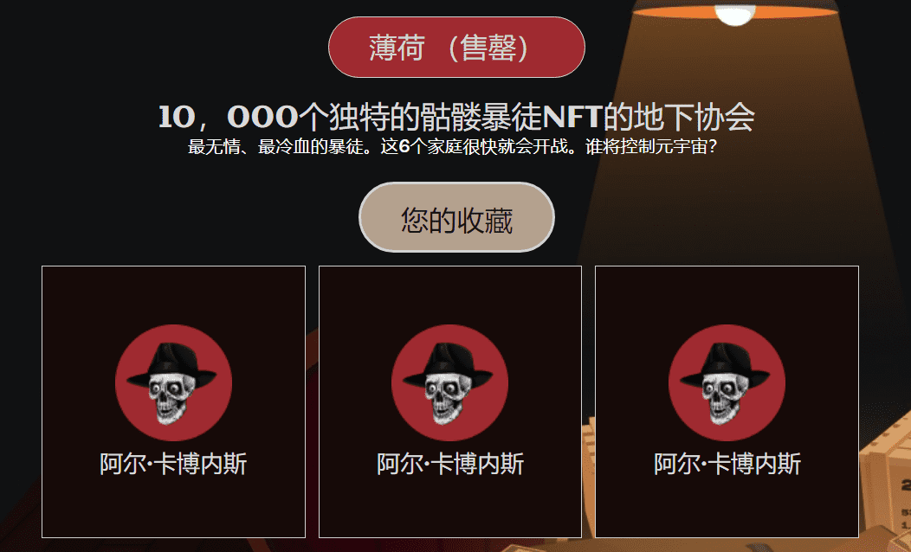

# Al Cabones

Al Cabones，一个基于区块链的有组织犯罪集团网络。 该系列由 10,000 名通缉的骷髅暴徒组成，每个人都有自己的残酷犯罪历史。 在他们逃脱之后，他们选择进入并隐藏在他们计划制造更多混乱的区块链中。 是时候给元界提供麻醉剂了，对吧

## 性状

六个不同的黑帮家庭，由你的Al Cabone的背景决定。每个家庭都处于与另一个家庭的激烈竞争中。合同杀手与任何家庭都没有联系。

每个暴徒都是从150多个属性中以编程方式生成的，这些属性包括衣服，眼睛配件，头盔等等。所有10，000人都是臭名昭著的 - 但有些人比其他人具有更稀缺的特征。

## 常见问题

**拥有Al Cabone有什么好处？**

除了获得Al Cabones的全部商业使用权外，持有人还有权获得会员资格，这将为他们提供特殊津贴和独家福利。藏匿逃犯是有风险的，因此应该得到奖励。

**艺术是随机生成的吗？**

是的！每个黑帮都是完全独特的，具有150多种特征和数百万种可能的组合。

**如何铸造？**

Al Cabones可以在我们的网站上铸造，以进行初始发布。一旦它们售罄，您就可以在二级市场上以 Opensea.io 购买它们。然而，当心，法律潜伏着，不要让他们看到你的交换。

**薄荷需要多少钱？**

铸造Al Cabone将花费0.066 ETH +天然气。

**我可以在一次交易中铸造多少个Al Cabones？**

每个TX最多可以铸造15个Al Cabones。

**有多少个Al Cabones可用？**

总共将有10，000个Al Cabones在发布时可供铸造。

**铸币后多久，我的Al Cabones会被揭晓？**

总共将有10，000个Al Cabones在发布时可供铸造。

**铸币后多久，我的Al Cabones会被揭晓？**

揭晓将在发布后24小时进行。他们是被通缉的，我们不能浪费时间！

**是否计划与任何其他项目进行合作？**

我们已经在与NFT领域的几个流行社区进行讨论。我们对即将推出的所有即将到来的合作伙伴关系感到兴奋。
