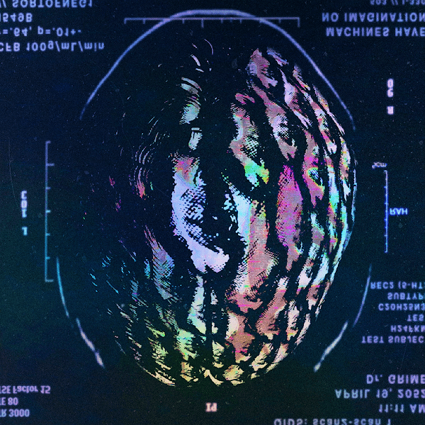

# ACTIVAT0R

//迷幻激活的庆祝活动//

// 机器没有想象力 // 机械思维由源代码控制，随意操作 //

// 释放自己 // 开放的思想是通往人类体验的桥梁 //

// 可作为 NFT 或物理吸墨纸打印 //

##### ▶ 什么是 ACTIVAT0R？

ACTIVAT0R 是一个 NFT（不可替代代币）集合。存储在区块链上的数字艺术品集合。

##### ▶ ACTIVAT0R 代币有多少？

总共有 19 个 ACTIVAT0R NFT。目前 2 位所有者的钱包中至少有一个 ACTIVAT0R NTF。

##### ▶ 最近卖出了多少ACTIVAT0R？

过去 30 天内售出 0 个 ACTIVAT0R NFT。

