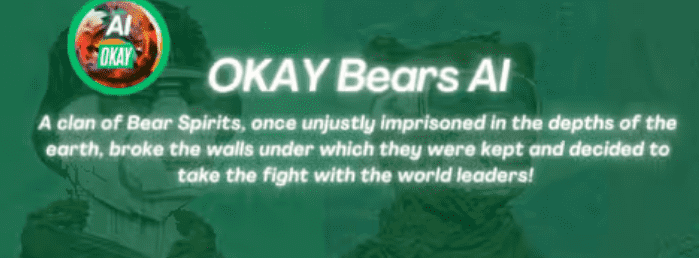

# Al Okay Bears KR

有一个神话……两亿年前！ 空气不沾泥土，雨水不养大地，到处都是火，燃烧着最后的生命。人们正在死去……。 妈妈们正在给他们的孩子最后一块面包，而他们却慢慢地去世了。 长辈的希望破灭！没有希望了！ 造成这一切的唯一原因是世界上所有部落的首领。他们为了权力和财富而做到了。直到有一天，曾经被不公正地囚禁在地球深处的熊灵族打破了 他们被关在墙下，并决定与世界领导人进行战斗！ 他们将他们的精神与地球的所有元素，空气，火，土和水融合在一起！他们踏上了复仇的旅程！

收藏供应：25,000
每个钱包最多 5 个 | WL 获得 1 免费

