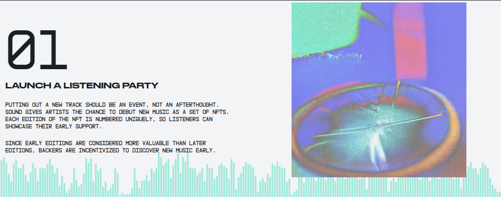

# Alara Music

声音就是音乐应该有的样子：由听众和艺术家之间的关系驱动。

我们正在为基于 web3 技术和价值观的更具协作性的音乐运动创建一个平台。

在 Sound 上，用户直接支持他们所爱的艺术家，并声称他们比其他人更早出现在那里。

##### ▶ 什么是 Alara 音乐？

Alara Music 是一个 NFT（不可替代令牌）集合。存储在区块链上的数字艺术品集合。

##### ▶ 存在多少 Alara Music 代币？

总共有 37 个 Alara Music NFT。目前，29 位所有者的钱包中至少有一个 Alara Music NTF。

##### ▶ Alara Music 最近卖出了多少？

过去 30 天内售出 0 个 Alara Music NFT。

