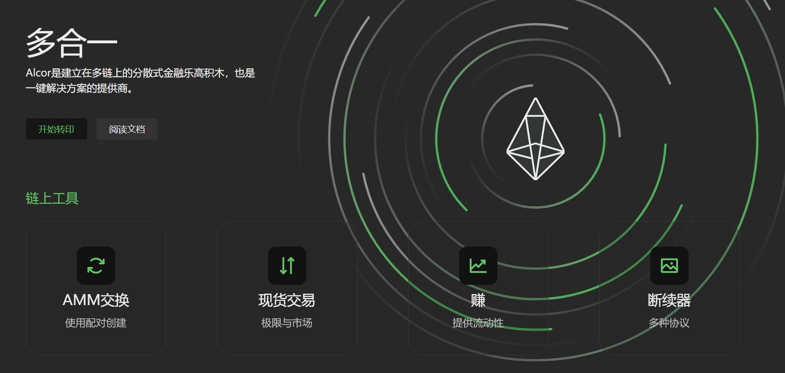

# Alcor.exchange

EOS 链上，灵活，免费上市，去中心化交易所，用于基于 eosio 的代币。 一键创建市场，随心所欲地交易。 忘记任何监管。 完全不收费。

---

## Alcor.exchange相關公鏈

**Tezos**

Tezos（XTZ）是一個多功能平台，支持去中心化應用程序（DApps）和智能合約。它是由前摩根士丹利分析師阿瑟·布雷特曼（Arthur Breitman）在妻子凱瑟琳·布雷特曼（Kathleen Breitman）的支持下開發的，並於2017年推出了首次代幣發行（ICO），籌集了2.32億美元的資金。 ICO一年後，Tezos於2018年7月啟動了beta網絡。

Tezos平台旨在將自校正協議和鏈上治理相結合來管理網絡修改，並支持Turing完整的智能合約。

Tezos基金會還支持Tezos，Tezos基金會是瑞士的一家實體，通過贈款和其他資本手段推廣Tezos協議。

**Polygon** 

Polygon 是一个去中心化的以太坊扩展平台，使开发人员能够以低交易费用构建可扩展的用户友好 dApp，而无需牺牲安全性。

**thundercore**

**WAX**

WAX (The Worldwide Asset eXchange™) 是世界上用於 NFT、dApp 和視頻遊戲的最常用和交易量最大的區塊鏈生態系統——為任何人創建、購買、出售和交易虛擬和實物物品提供最安全、最便捷的方式，在世界上任何地方。

WAX 被譽為“NFT 之王”，是領先的 NFT 網絡，已成功促進了來自 Topps（美國職業棒球大聯盟）、Capcom（街頭霸王）、Funko、Atari、索尼 Funimation 和著名電影（Princess Bride 和 SAW）、世界知名藝人（Deadmau5、Weezer 和 William Shatner）等等。

此外，WAX 還創新了 vIRL® NFT，這與您在其他區塊鏈上發現的標準 NFT 不同。它們具有許多動態功能，包括應用程序/視頻遊戲集成、營銷工具和 V-commerce 功能——將 vIRL® NFT 鏈接到現實世界的物品，因此您無需實際運送任何東西即可轉移所有權，直到收藏家準備好聲稱它是他們自己的。每個 vIRL® NFT 都是在將環境放在首位的節能和碳中性 WAX 區塊鏈上鑄造的。

**EOS**

EOS區塊鍊是一個由加密貨幣EOS支持的去中心化平台，並支持去中心化應用程序。 EOS協議通過模擬真實計算機的屬性（例如用於處理的硬件，本地/ RAM內存和硬盤存儲，其計算資源在EOS加密貨幣持有者之間平均分配）來像Google的Play商店和Apple的App商店一樣工作。

EOS支持智能合約，並充當分散式操作系統，旨在通過分散的自治公司模型來部署工業規模的分散式應用程序。

EOS智能合約平台消除了交易費用，每秒可進行數百萬筆交易，並具有旨在實現垂直和水平擴展分散式應用程序的區塊鏈架構。 EOS軟件提供了帳戶，身份驗證，數據庫，異步通信以及跨多個CPU內核和/或群集的應用程序調度。

**telos**
