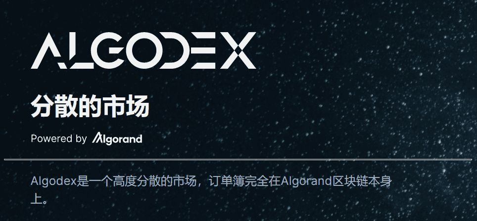
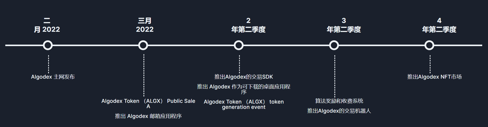
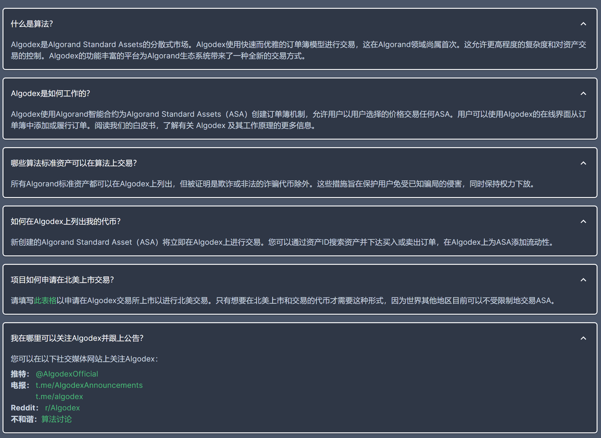

# Algodex

Algodex 是一个点对点市场，允许用户在称为 Algorand 标准资产 (ASA) 的 Algorand 区块链上交易用户制作的代币。 Algorand 标准资产由用户和公司创建，用于服务于软件实用程序、资产表示、奖励代币等目的。 所有 ASA 都存在于 Algorand 区块链上，并以 Algorand 的加密货币 ALGO 定价。 Algodex 允许用户与 Algorand 区块链交互以促进 ASA 的转移。
使用强大的 Algorand 区块链及其智能合约功能，Algodex 提供了独特的订单簿模型和界面，使用户能够以他们选择的价格交易 Algorand 标准资产。

---

**1.下市价单和限价单**

Algodex支持限价订单，因此您可以放心，您的交易只会以您设定的价格进行。

**2.交易所有算法标准资产（SAS)**

默认情况下，Algorand区块链上的所有资产在Algodex中都受支持。如果它存在，您可以交易它。是的 - 甚至是NFT。

**3.NFT交易**

直接在Algodex中购买和交易不可替代代币（NFT）。查看并对 NFT 出价，即使它们当前未在任何地方上市销售。

**4.质押奖励**

即将推出 - 每个代币都将有质押池，可以选择投注ALGX，ALGO和/或抵押代币。请继续关注更多信息。

---

## 路线图

## 常见问题

