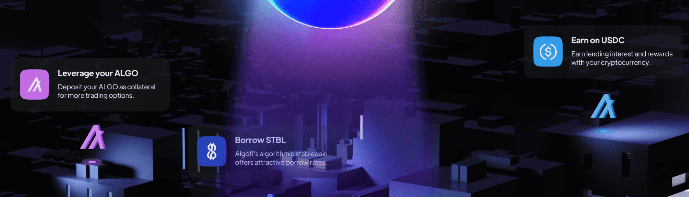

# Algofi

Algofi 平台允许 Algorand 用户借贷以赚取利息、获得杠杆或做空加密资产。

## 什么是阿尔戈菲？

Algofi 是 Algorand 区块链上的一个快速、低成本的加密借贷市场，它使去中心化借贷广泛可用。 Algofi 旨在成为第一家弥合传统金融与去中心化金融之间差距的加密原生银行。

## 关于阿高菲

Algofi是Algorand区块链上一个快速，低成本的加密贷款市场，使分散式贷款变得广泛可用。Algofi的目标是成为第一家弥合传统金融和去中心化金融之间差距的加密原生银行。Algofi的简单法定入口允许用户在没有银行或集中式托管人的情况下购买加密货币并赚取利息。此外，交易者可以使用算法做空或利用杠杆进行交易。未来，Algofi将提供更传统的银行服务，如储蓄账户和信用卡，所有这些都由Algorand上不断增长的DeFi生态系统提供支持。

## 阿尔戈菲如何使用阿尔戈朗

通过利用Algorand协议及其纯权益证明（PPoS）共识机制，Algofi能够促进在几秒钟内结算的低于美分的交易 - 这是Algofi用户友好，可大规模访问平台的关键组件。该基金会还将使阿高菲能够在交易数量方面继续扩展其平台，并在未来引入新的金融服务。此外，Algofi选择在Algorand上构建，因为它具有非常强大的原生社区和强大的开发人员工具的现成可用性，这些工具可以快速简单地创建为Algofi提供支持的智能合约。
