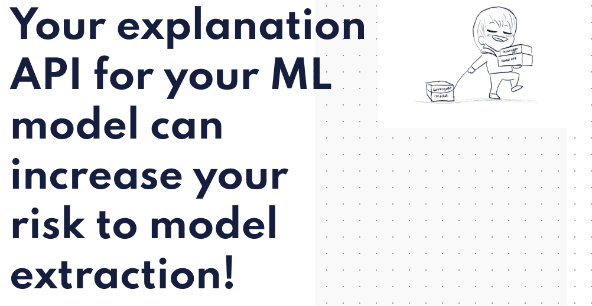

# Alice Through the Looking Glass

##### 近年来，解释机器学习模型的结果已成为默认设置。它使这些 API 的用户对模型的决策过程有了更多的了解，并建立了模型输出的可信度。但是，如果您想知道是否...

##### ▶ 什么是镜中的爱丽丝？

Alice Through thelooking Glass 是一个 NFT（非同质代币）集合。存储在区块链上的数字艺术品集合。

##### ▶ 有多少个爱丽丝透过镜子代币？

总共有 41 个 Alice Through thelooking Glass NFT。目前，16 位所有者的钱包中至少有一个 Alice Through the Looking Glass NTF。

##### ▶ 最近卖出了多少《爱丽丝透过镜子》？

过去 30 天内售出 0 个 Alice Through thelooking Glass NFT。

