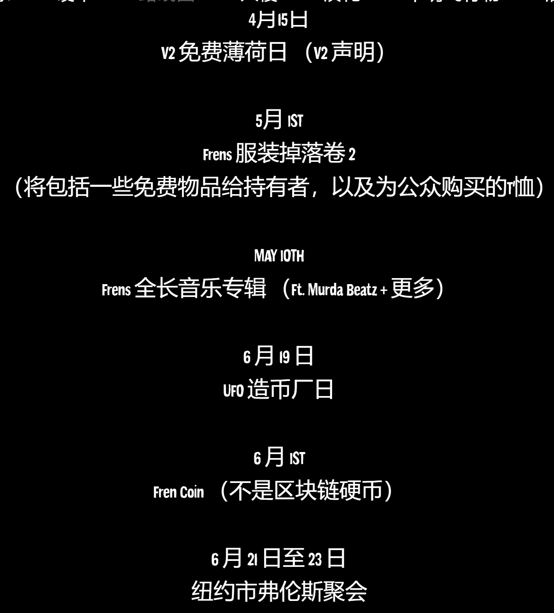

# Alien Frens

Alien Frens 是一个社区驱动的以太坊区块链上的 10k 个随机生成的 NFT 集合。 我们的目标是在元宇宙中建立最大的狂热群体。 1 Alien Fren NFT，它不仅为您提供了一个很棒的 PFP 和与 10k 其他 Fren 的终生友谊，还为您提供了 IRL 活动、入侵、独家商品、漫画书和 $FRENS 代币的门票。 哦，所有这些仅适用于我们季度路线图的 1.0 版。 准备好了吗？

---

## 谁是外星人FRENS？

alien frens是以太坊区块链上随机生成的10kERC-721令牌的社区驱动集合。我们的使命是在元宇宙中建立最大的 frens 组。拥有一只外星小鹪鹩可以让你终生进入一个充满特权的专属鹪鹩！这包括但不限于：参与入侵;参与我们入侵行星并通过我们定制的在线工具获得巨额奖品;访问令人难以置信的现场活动和体验;独家服装和商品掉落;一个全新的，可抵押的，免费的V2收藏品;可定制的不明飞行物，在银河系中旅行;访问我们的游戏管道;所有这一切最好的方面是，外星人的路线图每季度更新一次。我们倾听成员的意见，纳入来自我们社区的反馈，并以此为基础，为frens提供尽可能多的持续价值。

## 什么是派系？

Alien Frens分为4个派系，Xenos是最常见的，OLU是最罕见的。当我们入侵行星时，OLU将获得更大的奖品，最重要的是，他们也有更好的机会赢得这些奖品，因为只有1000个，在另一端，Xenos会有很多奖品，但奖品没有那么多汁。

## 路线图

> **我们对路线图的处理略有不同...**
>
> 当你走上一条为未来几年带来价值的道路时，你不仅有1个路线图。我们的路线图将每季度发布一次，因此每个季度我们都会有新的令人兴奋的事情，为我们的独家社区带来价值。

---

## 什么是外星人弗伦斯？

Alien Frens 是 10,000 个外星 NFT 的集合，它们在返回 Fren 星球的 Metaverse 中缩放。 该项目有明确的稀有性，因为有 4,000 个绿色普通，3,000 个黄色半稀有，2,000 个紫色稀有，只有 1,000 个红色超稀有外星人。
