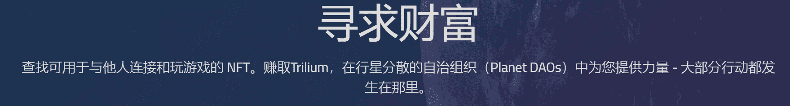
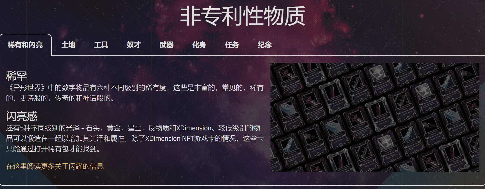

# Alien Worlds

外星世界
如果你可以在世界上创造任何东西，你会做什么？
使用 Trilium (TLM) 游戏代币加入 Alien Worlds 模拟地球经济。
在 Trilium 和基于 NFT 的社交元宇宙中寻求财富并茁壮成长。
通过虫洞开始……
欢迎来到异世界！
#buildingbetterworlds #thrive #Metaverse #NFTs #TLM

---

## 游戏基础

1. Alien Worlds是一个NFT元宇宙，您可以在其中玩独特的数字物品（NFT）。

2. 质押：玩家将Trilium押注给行星，以便在即将到来的行星选举中投票，并增加行星的奖励池。

3. 行星DAO：参加每周一次的理事会候选人选举，提交关于如何分配行星国库的建议，或者自己竞选行星理事会。

4. 交易游戏卡：玩家可以在币安智能链（BSC）和WAX上为他们的策略选择NFT游戏卡，用于采矿，战斗和任务。

5. 跨链桥接：在BSC，WAX和以太坊之间传送TLM。

   ---

   

   
