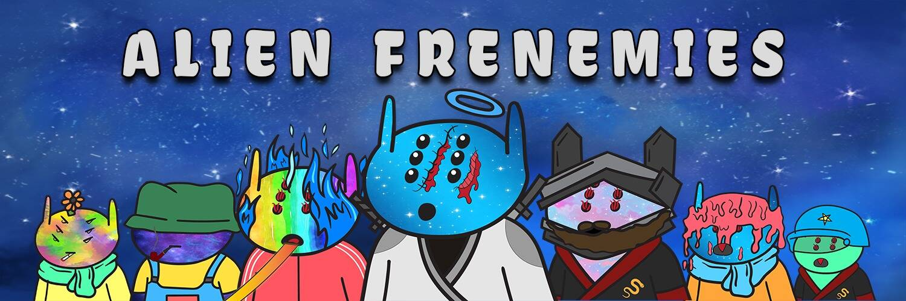

# Alien Frenemies

我们是一个由叛逆、反社会的外星人组成的星际民兵，他们在孤立、内向和元宇宙中假笑、合成笑、甜言蜜语的“狂热”社会中找到共同点。我们的目标是在存在的各个方面绝对统治——肉体世界和元宇宙。我们内心的愤怒和复仇将被知晓！我们不喜欢玩。我们不喜欢笑。我们不喜欢你。

##### ▶ 什么是外星敌人？

Alien Frenemies 是一个 NFT（非同质代币）集合。存储在区块链上的数字艺术品集合。

##### ▶ 有多少外星敌人代币？

总共有 1,058 个 Alien Fremies NFT。目前 131 位所有者的钱包中至少有一个外星友敌 NTF。

##### ▶ 最近卖出了多少外星敌人？

过去 30 天内售出了 0 个 Alien Fremies NFT。

