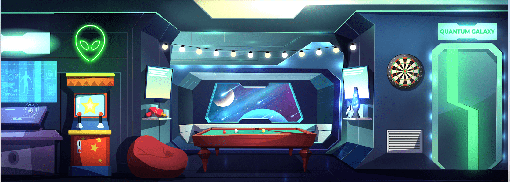

# Aliens Amongst Sheep

羊群中的外星人收藏了 9,876 件手绘艺术作品，它们代表了一个勇敢的精英社区，他们勇敢地创造了自己的人生道路。

我们的愿景是建立一个由个人组成的专属俱乐部，他们不仅思维方式与大多数人不同，而且有能力和毅力挑战现状，创造值得过的生活。

拥有一个外星人对其他人来说象征着你是少数在实现个人自由之前不惜一切代价的人之一。

所以问问自己，你是随波逐流的绵羊，还是掌控自己命运的外星人？

