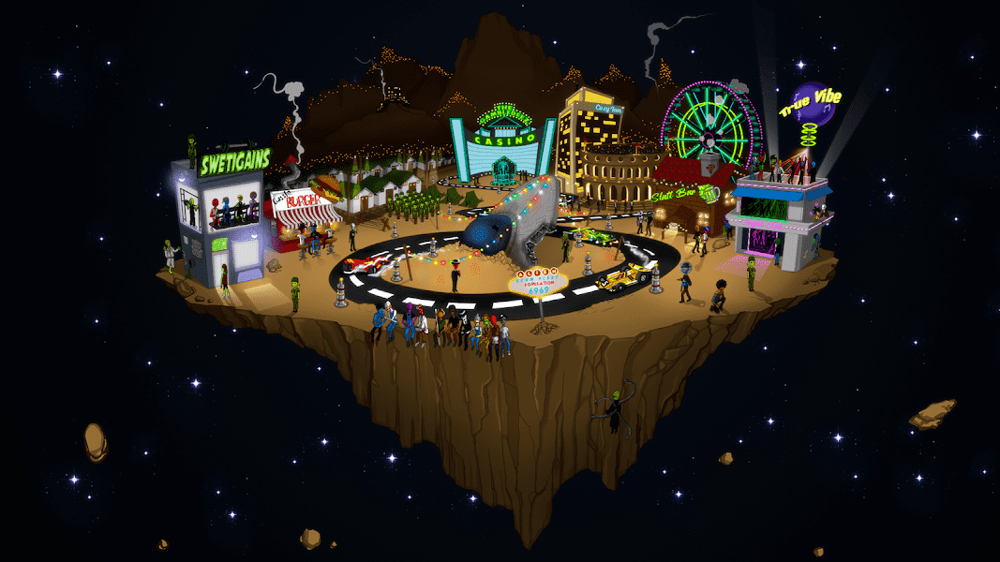

# The Alien Scum Fleet

##### ▶ 什么是外星人渣舰队-创世纪？

Alien Scum Fleet - Genesis 是一个 NFT（不可替代令牌）集合。存储在区块链上的数字艺术品集合。

##### ▶ 存在多少 Alien Scum Fleet - Genesis 代币？

总共有 1,250 个 Alien Scum Fleet - Genesis NFT。目前，363 位车主的钱包中至少有一个 Alien Scum Fleet - Genesis NTF。

##### ▶ 什么是最昂贵的外星人渣舰队 - 创世纪销售？

最昂贵的 Alien Scum Fleet - Genesis NFT 是 [Alien Scum Fleet #1208](https://www.nft-stats.com/asset/0x2e24b9bca2c7715b60df1c347481c3222ec317a2/1208)。它于 2022-06-12（2 个月前）以 14.7 美元的价格售出。

##### ▶ 外星人渣舰队-创世纪最近卖出了多少？

过去 30 天内售出了 7 个 Alien Scum Fleet - Genesis NFT。

##### ▶ 有哪些流行的 Alien Scum Fleet - Genesis 替代品？

许多拥有 Alien Scum Fleet-Genesis NFT 的用户还拥有 [Ghost Frens Collection](https://www.nft-stats.com/collection/ghost-frens-collection)、 [Wicked Craniums Comic](https://www.nft-stats.com/collection/wickedcraniumscomic)、 [NFT Siblings Avatars](https://www.nft-stats.com/collection/nftsiblings)和 [Chromospheres](https://www.nft-stats.com/collection/chromospheres)。

