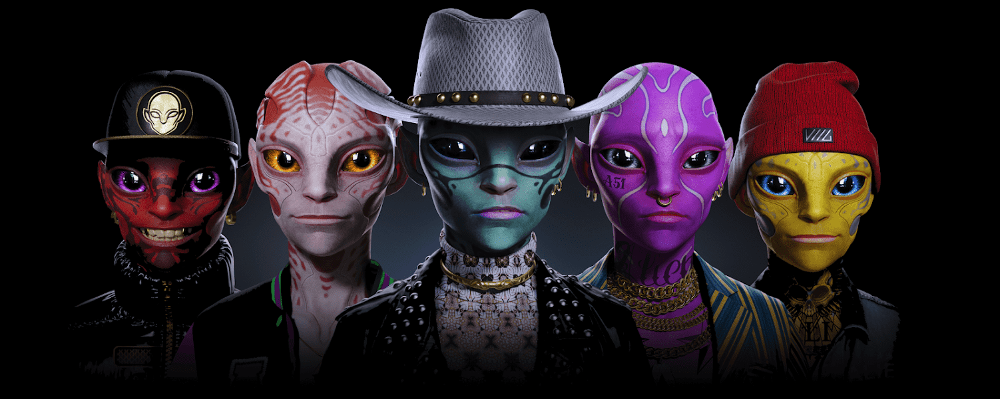

# Alienverse DMSG

Alienverse - NFT NFT 在过去 7 天内售出 3 次。Alienverse - NFT 的总销售额为 96.06 美元。Alienverse - NFT NFT 的平均价格为 32 美元。有 593 名 Alienverse - NFT 所有者，总共拥有 2,521 个代币。

45% 的集合被质押并为持有者生成 $ALN 代币。Alienverse 是一个 NFT 集合，位于数字艺术和时尚的十字路口。David Masson San Gabriel 创作的 2525 件超逼真的 3D 艺术作品由 200 多个手工制作的特征组成。Alienverse 是一个 NFT 集合，位于数字艺术和时尚的十字路口。2525 件超逼真的 3D 艺术作品由 200 多个手工制作的特征组成，将席卷全球。

