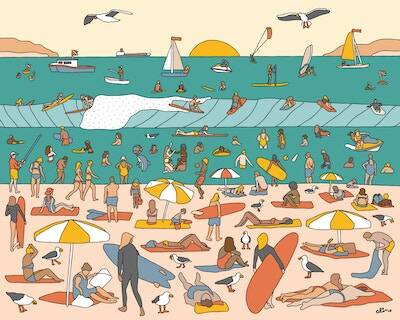

# Alimo - Sketchbook Collection

国际艺术家和设计师 Alimo——以其曲线优美的后流行图像、高度饱和的色彩、充满活力的手绘字母以及排列在平坦色调表面上的人物所居住的世界而闻名——将放弃他的第一个个人 NFT 雪地系列。

这个故事讲述了一群朋友去偏远地区进行单板滑雪之旅，以及其间的所有乐趣。这 24 个一对一的 NFT 代表一卷胶卷，类似于拍摄摄影。所有灵感都来自于偏远地区的真实事件。10% 的主要销售额将用于 sea-trees.org。

