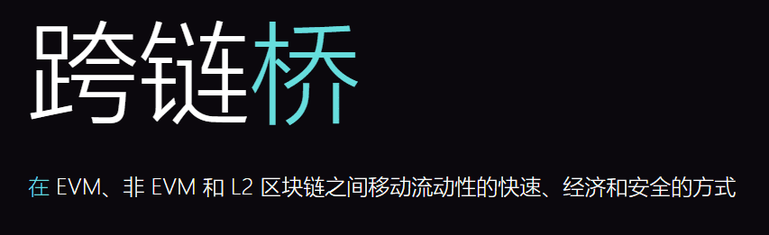
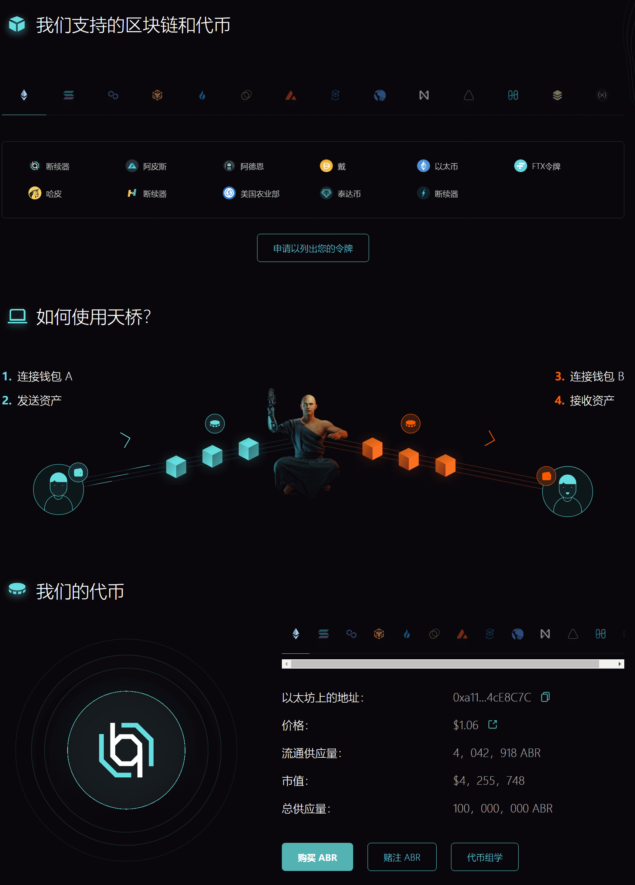

# Allbridge

Allbridge 是一种在不同网络之间转移资产的简单、现代且可靠的方式。 它是 EVM 和非 EVM 兼容区块链之间的桥梁，旨在涵盖 L2 解决方案和未来的 NFT 转移。
Allbridge 的使命是让区块链世界无国界，并提供一种在各种区块链之间自由移动资产的工具。

## Allbridge的特色

- **EVM 和非 EVM 链**

  我们在EVM（如以太坊，多边形，BSC），非EVM兼容（如Solana，NEAR）区块链以及L2 - 区块链之间架起桥梁。

- **最快的转账**

  每次转账涉及2笔交易：在源链和目标链上。转移只需要给定区块链确认所需的时间。

- **无限制**

  Allbridge支持原生代币转账，以及造币和烧钱方法，该方法允许一次转账数百万美元。

- **费用减免和奖励**

  动态收费系统允许天桥抵押人降低转账费用。此外，80%的费用归ABR代币抵押人所有。

- **安全**

  我们的代码已经过行业安全领导者Hacken的审计。检查发现Allbridge的代码非常安全。还有更多的审计待定。

- **人性化设计**

  我们的目标是创建一个简单的设计，不需要用户阅读指南和文档。

  ---

  

  

---

## 介绍

**什么是区块链桥？**

区块链桥是一种连接，允许将令牌和/或任意数据从一个链传输到另一个链。两个链可能具有不同的协议、规则和治理模型，但桥为两个链的互操作创建了一个可靠的机制。

有很多不同的桥梁设计，但它们通常可以分为两类：依赖于信任或联合的更集中的桥梁，以及更分散的，无信任的桥梁。

**什么是锦桥？**

Allbridge是一种在不同网络之间转移资产的简单、现代和可靠的方式。它是EVM（如以太坊，多边形，BSC）和非EVM兼容（如Solana，Terra）区块链之间的桥梁，旨在涵盖L2（如Arbitrum，Optimism）解决方案和未来的NFT转移。

Allbridge的使命是使区块链世界无国界，并提供一种在不同网络之间自由移动资产的工具。
