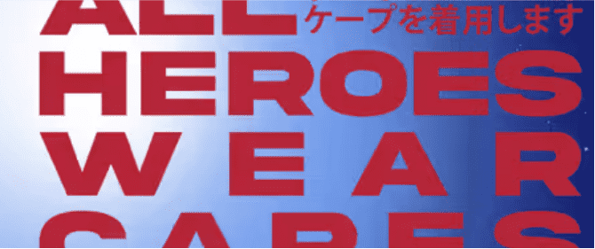

# All Heroes Wear Capes | Official

不是所有的英雄都穿斗篷……..有些人只穿领结。月弓来保护月球世界

##### ▶ 什么是 MoonBows 官方？

MoonBows Official 是一个 NFT（非同质代币）集合。存储在区块链上的数字艺术品集合。

##### ▶ 有多少个 MoonBows 官方代币？

总共有 2,222 个 MoonBows 官方 NFT。目前，1,106 位所有者的钱包中至少有一个 MoonBows 官方 NTF。

##### ▶ 最昂贵的 MoonBows 官方促销是什么？

最昂贵的 MoonBows Official NFT 是 [meta-bows #1905](https://www.nft-stats.com/asset/0x351649ee5d71ed635d34640a8096526fa9162d28/1905)。它于 2022-06-28（大约 2 个月前）以 0.9 美元的价格出售。

##### ▶ MoonBows Official 最近卖出了多少？

过去 30 天内共售出 1 个 MoonBows 官方 NFT。

