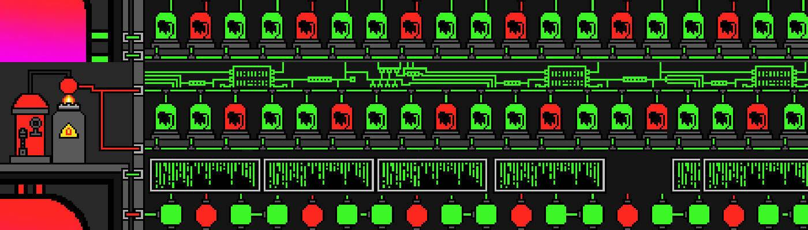

# Almighty Pigs NFT

##### 在以太坊区块链上创建了 1000 只创世纪全能猪来征服 Oinkverse。每个 Genesis Pig 都会产生 BOOM 代币，用于全能生态系统。来自 BOOM BOOM LAB 作为实用程序的 4000 只全能小猪▶ 什么是全能幼崽？

Almighty Cub 是一个 NFT（Non-fungible token）集合。存储在区块链上的数字艺术品集合。

##### ▶ 全能幼崽代币有多少？

总共有 39 个全能 Cub NFT。目前，118 位车主的钱包中至少有一个全能幼崽 NTF。

##### ▶ 最近卖了多少全能幼崽？

过去 30 天内共售出 0 个全能 Cub NFT。

