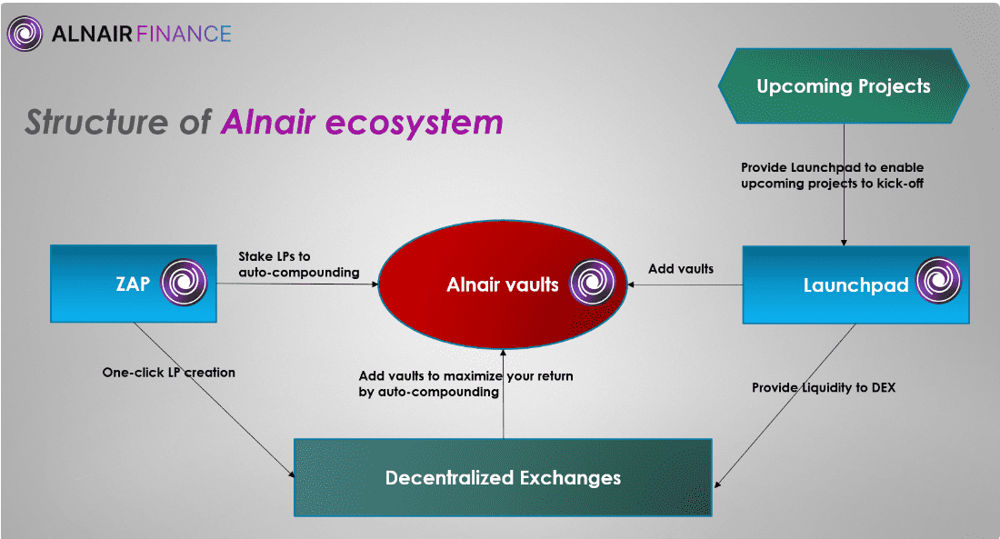

# Alnair Finance

​        Alnair Finance 是一个收益优化器平台，允许用户在 Alnair Vaults 中质押从 AMM（自动做市商）/DEX（去中心化交易所）发行的 LP 代币，这些 LP 代币会自动收获并重新质押他们的奖励作为 LP 代币以进行复利影响。
​        存款/取款的零费用可帮助用户自动获得更多奖励，而无需担心 Gas 费用。 Alnair Finance 是一个独特的收益农场，具有各种复杂的策略并奖励 $ALNR 持有者。 Alnair 用户可以访问 Boosted Vaults，其旨在将 APR/APY 提升到某些农场。
​        由于收益产生和复利过程中的自动化因素，用户无需手动将其质押奖励再投资，而只需将存款存入 Alnair Finance 保险库即可依靠自动化资产增长。持有人也不需要对支持自动化和收益优化的底层协议有广泛的了解，而将资金存入金库是一种被动的投资策略。
​        Alnair Finance 用 $ALNR 代币奖励用户，使用 $ALNR 代币，用户只需将 $ALNR 质押为 xALNR，就可以进一步产生更多利润。这些额外的兴趣层进一步加速了回报。
​        目标是增加用户存入资产的初始价值，进一步增加用户的被动收入，同时尽量减少用户端的参与。

- Alnair Finance 是一个独特的收益农场，具有各种复杂的策略并奖励 $ALNR 持有者。

- Alnair 用户可以访问 Boosted Vaults，其旨在将 APR/APY 提升到某些农场。

  

---

## 介绍

 Alnair Finance 是一个收益优化器平台，允许用户质押从 AMM 发行的 LP 代币（自动Alnair Vaults 中的做市商）/ DEX（去中心化交易所），自动收获并重新质押他们的作为 LP 代币的奖励，以产生复合效应。

通过存款/取款的零费用帮助用户轻松地自动获得更多奖励从燃气费。 Alnair Finance 是一个独特的收益农场，具有各种复杂的策略并奖励 $ALNR持有人。 Alnair 用户可以访问 Boosted Vaults，其旨在将 APR/APY 提升到某些农场。

由于产量生成和复合过程中的自动化因素，用户无需手动操作将他们的质押奖励再投资，但可以通过简单地向 Alnair 存入资金来依靠自动化的资产增长金融保险库。 持有者也不需要对支持的底层协议有广泛的了解自动化和收益优化，而将资金存入金库代表一种被动投资策略。

Alnair Finance 以 $ALNR 代币奖励用户，使用 $ALNR 代币，用户只需通过为 xALNR 质押 $ALNR。 这些额外的兴趣层进一步加速了回报。目标是增加用户存入资产的初始价值，进一步增加用户的被动收入，对用户端的参与最少。

---

## 什么是 Alnair Vault？

金库是一种投资工具，采用一套特定的单产策略。 他们利用自动化持续投资和再投资存入的资金，这有助于实现高水平的复利兴趣。

通过使用 Alnair 保险库来复合您的奖励，您可以节省数千笔交易及其相关的 gas 成本，和宝贵的个人时间。 而不是手动收获和出售奖励，购买更多代币并再投资不断地，保险库会以高频率自动完成所有这些工作。

保险库是 Alnair Finance 生态系统的核心。 在 Alnair 保险库中，您可以获得更多的资产，无论这是流动性池 (LP) 代币还是单一资产。 随时都可以从保险库中撤出及时。

在平台上浏览金库时，您会看到年收益率（APY），它取频繁与没有考虑的年百分比率 (APR) 相比，复合考虑。 您还将每天看到利息百分比和所有用户在保险库中投资的总金额 (TVL)。

此外，人们可以看到保险库使用什么底层平台作为收入来源。 每个保管库都可以指投资于流动性池的一对代币，如Astar网络生态系统内的ASTR/WETH LP代币，或投资于借贷平台或单一权益奖励池的单一代币。
