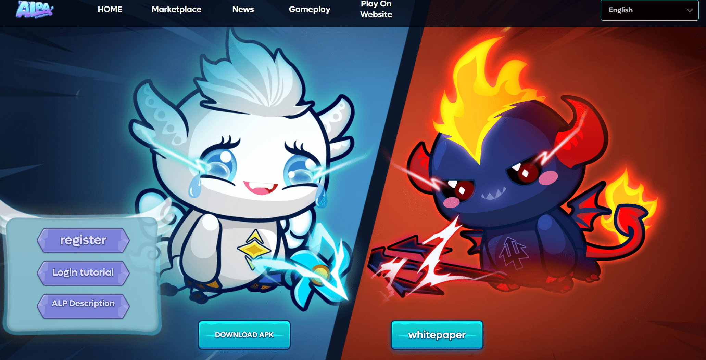
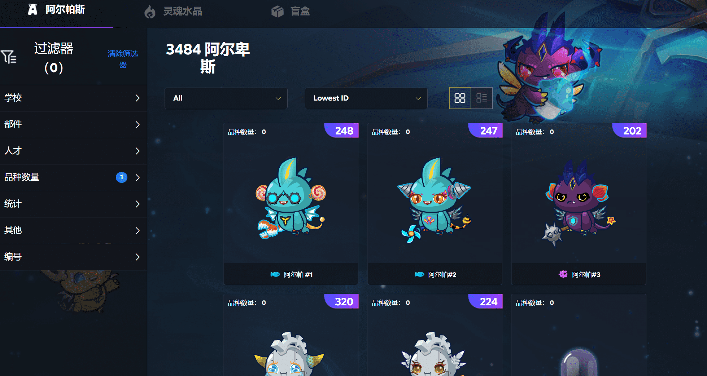
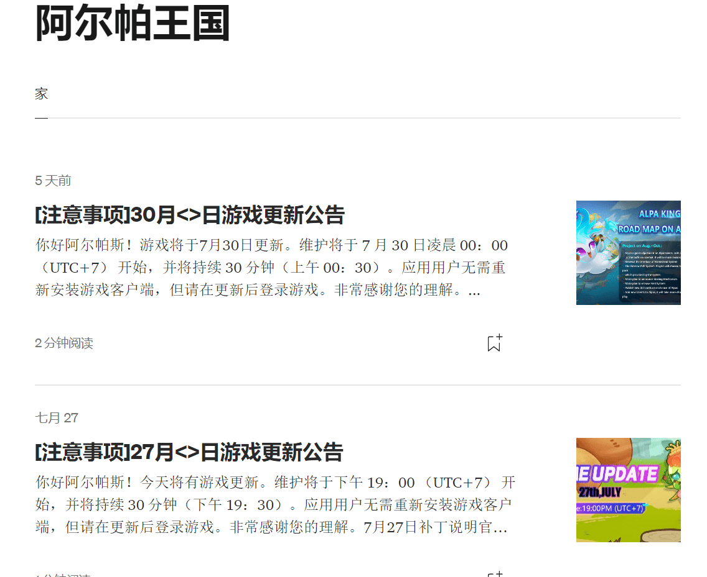

# AlpaKingdom

​        Alpa Kingdom 是一个虚拟世界，建立在 Web3.0 之上，与真实世界平行运行。作为一个庞大的、可穿越的网络世界，具有货币资产、社交方式和完整的空间感知和物理规则，它不仅独立于现实世界，而且与现实世界相辅相成。玩家可以简单地玩游戏来获得丰厚的收益。在游戏中，玩家可以战斗和交易统称为阿尔帕的奇妙生物等。
​        基于高质量的游戏开发，我们旨在为玩家提供一个有趣的游戏环境，然后围绕它创建一个社区，以提高社区的创造力和价值，也让每个人都能获得经济回报。
​        玩家的游戏内属性以基于合约 ERC-721 产生的 NFT 形式出现。在游戏中，NFT 可以在市场上交易，也可以通过 P2P 出售给其他玩家。
​        我们希望在开发游戏的同时，也与玩家一起探索 NFT 无穷无尽的应用场景，创造出全球广泛认可的 NFT 属性，赋予 NFT 每一面独特的价值。

​        玩家可以通过以下方式赚取 NFT：

- 战斗 PvP 战斗以获得奖励。

-  培育羊驼并在市场上出售。

- 收集稀有的阿尔帕，如纯种阿尔帕和拥有稀有技能和天赋的人。

- 出售培育阿尔帕斯所需的物品。

- 参加宅基地活动，赢得每日冠军，在市场上出售宅基地生产的物品。

  我们不仅是开发者，也是玩家。我们坚信，未来我们可以将工作和娱乐完美融合。
  欢迎来到阿尔帕王国的奇妙世界！

  

## 阿尔帕市场

## 阿尔帕王国消息

