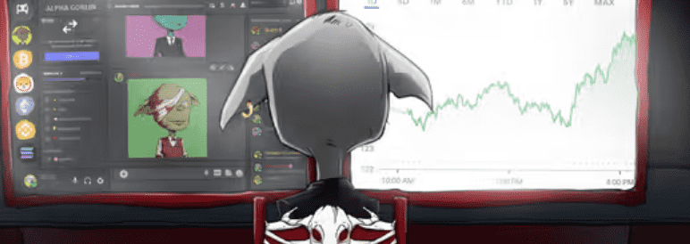

# Alpha Goblins

贪婪或无知，妖精不会放弃其他妖精的 graAab as
MannY 你想要的价格是便宜的狗屎 0.0044

过去 7 天内，Alpha Goblins NFT 被售出 4 次。Alpha Goblins 的总销售额为 1.43 美元。一个 Alpha Goblins NFT 的平均价格为 0.4 美元。有 1,780 名 Alpha Goblins 所有者，总共拥有 4,444 个代币。

alPHa goobliiNss #fortheculture

freemint && alPHaa 服务器

来自nansen.ai的aLPha suUbscRR

aCC0esse diSCC0rd with veriFF 2+++总共有 4,444 个 Alpha Goblins NFT。目前，1,780 名所有者的钱包中至少有一个 Alpha Goblins NTF。出售的最昂贵的 Alpha Goblins NFT 是 [Alpha Goblins #3905](https://www.nft-stats.com/asset/0x8de836cd80c4b2d594179f8eb380bdab3d0ddafb/3905)。它于 2022-06-07（3 个月前）以 51.7 美元的价格售出。

