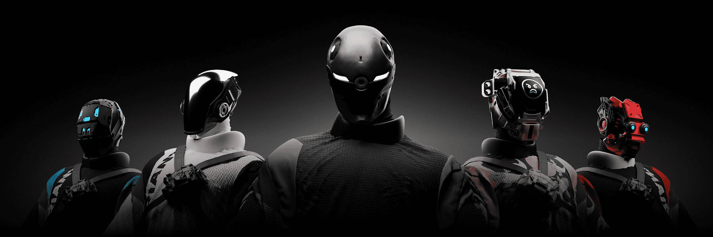

# Alpha Variant

Variant 是一个建立其他项目承诺的元宇宙的品牌。

3,333 个变体位于以太坊区块链上，由活跃的 Affinity 社区拥有。目标很明确：执行。每个 Variant 都可以在 DAO 中投票并决定 Web 3 的未来。

改变文化，改变元。

##### ▶ 什么是 Alpha 变体？

Alpha Variant 是一个 NFT（不可替代代币）集合。存储在区块链上的数字艺术品集合。

##### ▶ 存在多少个 Alpha Variant 代币？

总共有 114 个 Alpha Variant NFT。目前 7 位所有者的钱包中至少有一个 Alpha Variant NTF。

##### ▶ 最近卖出了多少 Alpha Variant？

过去 30 天内售出 0 个 Alpha Variant NFT。

