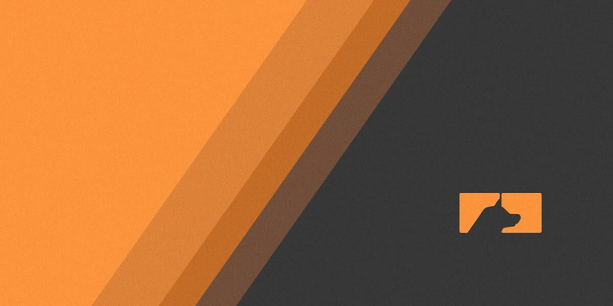

# AlphaDoggg Extras

Alphadoggg 标签是一个 100/100 版本的 NFT（由惊人的 CFW 设计），为它的持有者提供下面描述的所有实用程序，为期 24 个月。

Alphadoggg 标签的主要价格是**2 ETH**，并且**只有 100 个可用。**

一旦 24 个月到期，随着我们 Alphadoggg 的发展，标签持有者将在接下来的两年内拥有优先续订的权利。在 24 个月的每个月中，每个通行证持有者都能够以 0.1 ETH 的价格申请签名掉落。

这些 NFT 将被铸造到 Alphadoggg 签名集合中，并且可以像您拥有的任何其他 NFT 一样进行交易。

**所有展示的艺术品都是为了展示艺术家的作品，并不代表他们将为水滴创作的作品。**

我们最初的艺术家阵容包括：

- \- Des Lucrece
- \- 布兰登强大
- \- 马克哈比比
- \- Timpers
- -Shakkablood
- \- 杰克德根
- \- 现实

您可能希望保留您的 Signature 系列，因为在第一年年底持有全部 12 个的人将获得奖励每隔几周就会有少量较小的版本。这些可能是 25/25 或更少，这将在感兴趣的 AlphaDoggg 通行证持有者之间进行抽奖。

这些的索赔价格可能会有所不同，以符合艺术家和正在发布的内容。

我们最初的有限艺术家阵容包括：

- \- 扎克·里奇
- \- CFW
- \- 液体密度
- 
