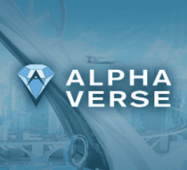

# AlphaVerse / The Hub

每个宇宙都提供独特的体验。

您可以购买土地、房屋、建筑物、公寓、定制它们、结识朋友、玩耍、聊天、交易、赚钱等等！

我们的生态系统将包括“学习赚钱”、“创造赚钱”和“玩赚钱”机制，例如租赁、质押、组织收益分成的活动等等，因此每个人都可以参与到生态系统中。

预售在不同的市场上进行，使用它们的本地加密货币。▶ 什么是 AlphaVerse Apex Predators？

AlphaVerse Apex Predators 是一个 NFT（不可替代令牌）集合。存储在区块链上的数字艺术品集合。

##### ▶ 存在多少 AlphaVerse Apex Predators 代币？

总共有 2,029 个 AlphaVerse Apex Predators NFT。目前，98 位所有者的钱包中至少有一个 AlphaVerse Apex Predators NTF。

##### ▶ 最近售出了多少 AlphaVerse Apex Predators？

在过去 30 天内售出 0 个 AlphaVerse Apex Predators NFT。

