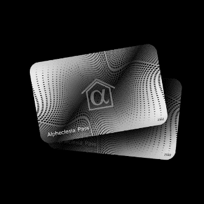

# Alpheclesia Pass

Alpheclesia 是人们在 NFT 和加密空间中发现 alpha 和日常使用工具的新方式。我们希望专注于交付，而不是其他项目关注的对投资者没有任何帮助的典型事情。我们决定以老式方式在 OpenSea 上以每张 0.01 的价格进行铸币，在售出所有 1000 张通行证后，discord 组将向通行证持有者开放。▶ 什么是 Alpheclesia 通行证？

Alpheclesia Pass 是一个 NFT（非同质代币）集合。存储在区块链上的数字艺术品集合。

##### ▶ 存在多少 Alpheclesia Pass 代币？

总共有 1 个 Alpheclesia Pass NFT。目前 3 位所有者的钱包中至少有一个 Alpheclesia Pass NTF。

##### ▶ 最近卖出了多少张Alpheclesia Pass？

过去 30 天内售出 0 个 Alpheclesia Pass NFT。

