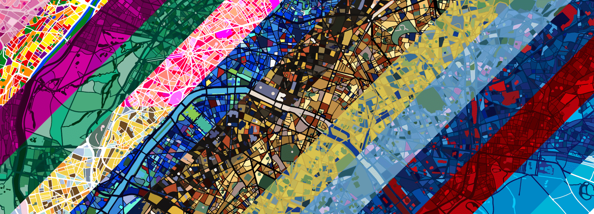

# Alto city

Alto city NFT 在过去 7 天内售出 7 次。 Alto city 的总销售额为 52.06 美元。 一个 Alto city NFT 的平均价格为 7.4 美元。 有 952 名 Alto 城市所有者，拥有 4,287 个代币的总供应量。

横跨全球的 1060 个城市有 15 种不同的配色方案，9 种原创和 6 种反映对著名艺术家的致敬。 该集合包括总共 15,900 个独特的 NFT。Alto city 是一个 NFT（非同质代币）集合。 存储在区块链上的数字艺术品集合。
▶ 奥拓城代币有多少？
总共有 4,287 个 Alto city NFT。 目前，952 位车主的钱包中至少有一个 Alto city NTF。
▶ Alto city 最贵的拍卖品是什么？
最昂贵的 Alto city NFT 是中国泉州 - 向文森特梵高致敬。 它于 2022-08-19（5 天前）以 9.8 美元的价格售出。

