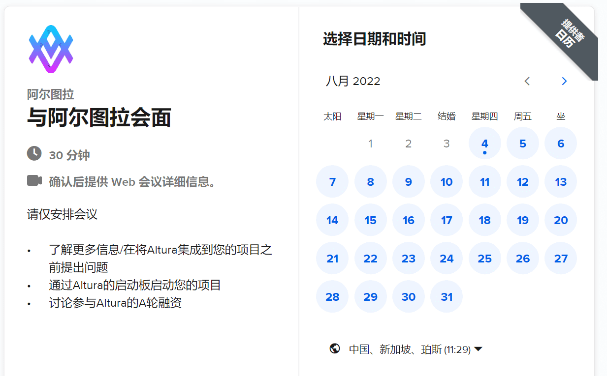
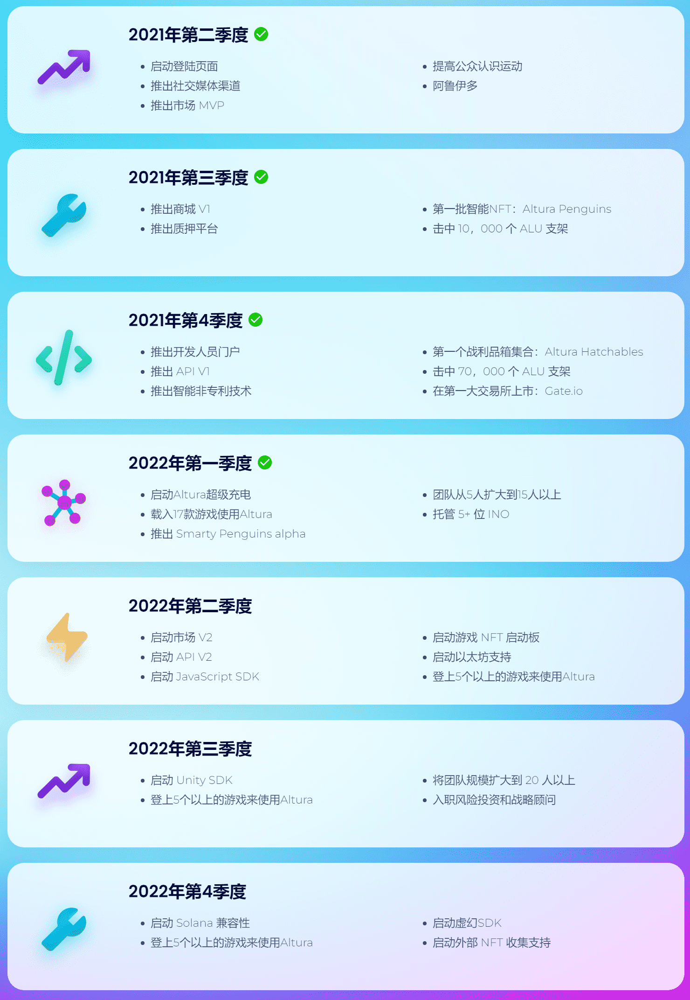

# Altura NFT Marketplace

​        游戏内物品是任何电子游戏的重要组成部分，允许游戏玩家拥有数字资产。 然而，游戏内物品是集中的，不易交换，实施起来也很困难。 Altura 是一个智能合约平台，允许游戏开发者铸造、分发和交易代表游戏内物品的智能 NFT。 智能 NFT 是具有动态属性的 NFT，可以根据特定条件发生变化。 智能 NFT 是使去中心化游戏内物品成为主流的下一步，并提供了传统 NFT 无法实现的大量潜在机会。 我们希望创建一个易于使用的界面和 API 来创建智能 NFT，一个使用 Altura 代币交易 NFT 的开放市场，我们希望将真正随机的智能战利品盒引入区块链。

---

## 什么是阿尔图拉

Altura使游戏开发人员无需任何web3知识即可利用区块链支持的资产的力量。Altura为游戏开发人员提供了工具，支持和基础架构，以将web3技术无缝集成到他们的视频游戏和应用程序中。

Altura旨在成为游戏开发人员启动其web3游戏的多合一解决方案。除了提供整合区块链支持的资产和数字资产市场的工具外，Altura还将为web3游戏提供资金，启动和曝光。

## 为什么使用Altura？

**简单集成**

使用API和SDK，游戏开发人员可以利用区块链技术的力量，而无需任何复杂的web3代码

**多链**

Altura支持最流行的EVM区块链（ETH，BSC，MATIC），对开发人员没有任何限制

**多博弈经济**

Altura 支持游戏内物品在游戏中的互操作性

**启动板**

Altura提供了一个启动板和启动web3游戏的初始曝光。

**NFT市场**

凭借跨链支持，令人惊叹的UI和大量功能，Altura的NFT市场是加密领域最好的游戏市场。

**智能非专利技术**

想象一下，一把电子游戏剑每次被用来杀死怪物时都会变得更强。智能NFT是通过Altura的API或SDK免费即时更新的NFT。

---

## 用户

**概述**

用户不需要注册或创建帐户来持有Altura NFT.但是，用户需要一个EVM兼容的地址（0x...）和一个web3钱包来与Altura市场进行交互，持有区块链支持的游戏内物品，并在游戏中进行身份验证。

所有端点都自动与每个 EVM 兼容的地址配合使用。

用户可以通过Altura市场自定义其个人资料（用户名，个人资料图片，生物和社交链接）;可以在任何应用程序中获取和使用此元数据。

---

## 了解 Altura NFT

**供应**

与ERC721 NFT不同，ERC1155 NFT可以具有大于1的供应量，并且可以由几个人同时持有，这类似于ALU等BEP20令牌。

**性能**

项目可以具有表示为键值对的属性。这些属性必须在铸造时设置。所有属性值都是字符串，这意味着它们可以表示从整数到布尔值的任何数据类型，但是游戏开发人员有责任相应地解析和更新这些属性。

属性可以是静态的，也可以不是静态的。静态属性不能改变，并且将永远具有它在造币厂上具有的价值。项目创建者可以通过 API 更改非静态属性。

属性可以表示项目的状态，例如，它们可以表示项目的运行状况、强度或项目是否已被消耗等。

**可堆叠与不可堆叠**

铸造NFT时，您可以指定它是可堆叠的还是不可堆叠的。例如，铸造100个可堆叠NFT的供应量将创建一个NFT（tokenId = x），供应量为100;此NFT将在用户的钱包中显示为单个项目，即使用户拥有该项目的多个。铸造100个不可堆叠NFT的供应量将创建100个NFT（tokenId = x，x + 1，...，x + 100）的供应量。这意味着，如果用户拥有其中的几件物品，它们将在用户的钱包中显示为唯一物品。

**最大供应量和铸造供应量**

物品的最大供应量可以大于其流通供应量。这意味着NFT的创建者可以继续铸造更多的供应，直到铸造的供应量等于最大供应量。

**图像**

在铸造物品时，您可以提供几张图像来表示物品可能采取的不同状态。例如，如果您正在为Minecraft铸造一把剑，则可以提供几张图片来表示物品的磨损。在mint之后，您还需要选择该项目的初始图像，然后可以通过API将图像更改为其他提供的图像之一。

`imageIndex` 是所有上传图像中所选图像的索引。 

`imageCount` 是上传图像的总数。

项目的初始图像不必是第一个图像（`imageIndex` = 0），它可以是任何上传的图像（`imageIndex` = x） 

---

## 与阿尔图拉会面

---

## 路线图

