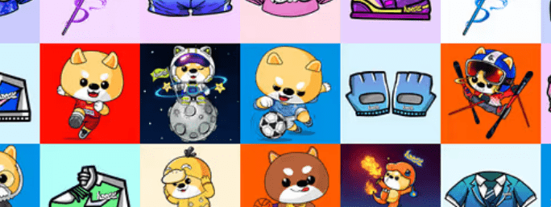

# AmazingDogeNFTs

AmazingDoge 是一个 Web3.0+ 社交元节项目。在社交元宇宙中，你可以有自己的元宇宙角色，你可以当市长，你可以当总统，你也可以当商人。 AmazingDoge 搭建了一个Web3.0+社交元宇宙平台，每个人都可以发布自己的“动议”，这个“动议”是一个可以交易的NFT，“动议”的点击量越高，NFT就会更有价值，想想，是不是很好玩？自项目创建以来，开发团队完成了CMC登录、CG，完成了GameFi人物NFT建模，完成了金融NFT铸造，ZT股票登录，并参与了Golden Finance.3

ADOGE NFT 分为两种，也号称在 Binance Chain 上独树一帜。4 一种是金融 NFT，另一种是 GameFi NFT。5 两种 NFT 具有不同的特性，根据稀有程度从低到高分为不同的颜色这是黄色-橙色-红色-蓝色-紫色-钻石.6

金融 NFT 可以通过赌博获得 ADOGE 代币奖励。7 游戏 NFT 可以通过游戏获得 ADOGE 代币奖励。 据开发团队介绍，ADOGE游戏已经完成了角色构建，分别是战士、神射手、法师、铸造师和刺客。

