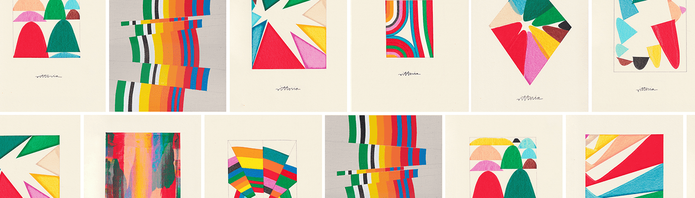

# Amber Vittoria's Artwork

Amber Vittoria 是一位在纽约市工作的艺术家和诗人。通过简单的抽象形式、色彩丝带和欢乐的文字，她的作品旨在表现女性的细微差别。她与 Andrews McMeel 合着的新书计划于 2023 年初出版。Amber Vittoria 的艺术品 NFT 在过去 7 天内被售出 2 次。Amber Vittoria's Artwork 的总销售额为 317.26 美元。Amber Vittoria 的艺术品 NFT 的平均价格为 158.6 美元。Amber Vittoria 的艺术品拥有者 530 人，总共拥有 926 个代币。

##### ▶ Amber Vittoria 的艺术品是什么？

Amber Vittoria 的艺术品是一个 NFT（不可替代令牌）集合。存储在区块链上的数字艺术品集合。

##### ▶ Amber Vittoria 的艺术品代币有多少？

总共有 926 个 Amber Vittoria 的艺术品 NFT。目前，530 位业主的钱包中至少有一个 Amber Vittoria's Artwork NTF。

##### ▶ Amber Vittoria 最昂贵的艺术品拍卖会是什么？

Amber Vittoria 出售的最昂贵的艺术品 NFT 是 [To All The Realities #10/30](https://www.nft-stats.com/asset/0x31237f02f9b7ffc22ea7a9d9649520c0833d16f4/779)。它于 2022-06-20（2 个月前）以 878.2 美元的价格售出。

##### ▶ Amber Vittoria 最近卖出了多少件 Amber Vittoria 的艺术品？

过去 30 天内售出了 164 个 Amber Vittoria 的艺术品 NFT。

##### ▶ Amber Vittoria 的艺术品需要多少钱？

过去 30 天，Amber Vittoria 的 Artwork NFT 最便宜的销售额低于 86 美元，最高的销售额超过 271 美元。在过去 30 天内，Amber Vittoria 的艺术品 NFT 的中位价格为 127 美元。

