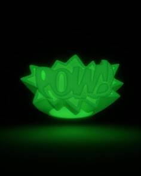

# AMBUSH OFFICIAL POW! GLOW IN THE DARK

##### ▶ 什么是伏击官方战俘！在黑暗中发光？

伏击官方战俘！GLOW IN THE DARK 是一个 NFT（非同质代币）集合。存储在区块链上的数字艺术品集合。

##### ▶ 多少埋伏官方 POW！GLOW IN THE DARK 代币存在吗？

总共有 99 个 AMBUSH 官方 POW！在黑暗 NFT 中发光。目前 92 位车主至少拥有一份 AMBUSH OFFICIAL POW！黑暗中发光 NTF 在他们的钱包里。

##### ▶ 什么是最昂贵的 AMBUSH OFFICIAL POW！在黑暗中发光销售？

最昂贵的 AMBUSH 官方 POW！GLOW IN THE DARK NFT 出售的是 [POW！®︎ “GLOW IN THE DARK”](https://www.nft-stats.com/asset/0xbc3f922d19647e5d3307c9cdc4c59a31461ee197/29)。它于 2022 年 6 月 8 日（3 个月前）以 120 美元的价格售出。

##### ▶ 多少埋伏官方 POW！GLOW IN THE DARK 最近卖了？

有 3 个 AMBUSH 官方 POW！过去 30 天内售出的 NFT 的 GLOW IN THE DARK。

