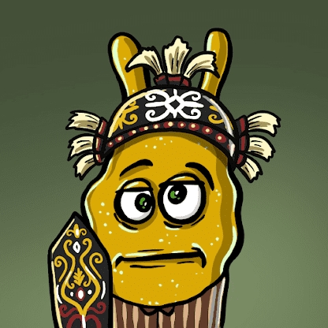

# Amoeba Kingdom

变形虫王国联合

在这里加入我们的社区 https://linktr.ee/amoeba_kingdom_nft

如果您想购买我尚未列出的 NFT，请以价格：0.004 eth 提供您喜欢的 NFT，并在电报上告诉@kelaskriptocepod 我会接受

第一个在地球上诞生的变形虫。之后，真正的细胞从 2000 年进化而来，变形虫（星际浮游生物遗产）在大约 40 亿年前与蛋白质和基于 DNA 的基因一起进化。后期重型轰炸结束。在南极洲发现了大约 1000 个标本以及神秘的材料，可能是地球上早期的珍贵活体材料。

