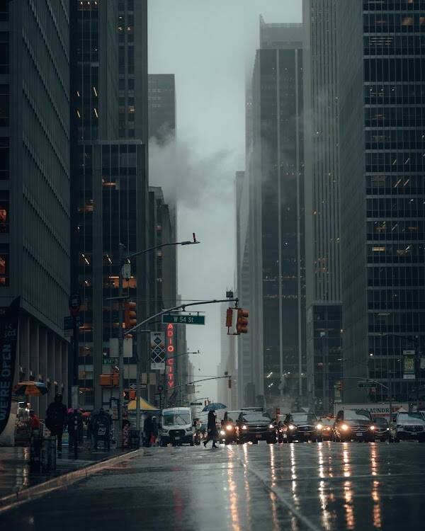

# Amongst Giants Edition

“巨人之间”展示了大城市的日常生活和我对下雨时的热爱。

“在巨人之间”是一个 35 件的版本，展示了大城市的日常生活和我对下雨时的热爱。

最新著作《巨人之间的揭示》是我对政治、宗教和生活中极地力量的世界观的一种更个人化的方法。我还在我的作品中加入了一些咆哮，其中包括八月的十二天日记和十一月的九天切线。在我的新书的第 3 部分中，我添加了我在 2017 年 7 月出版的第一本书中遗漏的诗歌，逐帧透过我的眼睛。此外，我还写了很多诗作为送给朋友的礼物，另外，我还附上了几封以诗意的方式写给我一生中最敬佩和最爱的人的私人信件。我花了六个月的时间来写这本书的第 1 部分，我花了无数个日日夜夜倾注我的灵魂，尽我所能！

