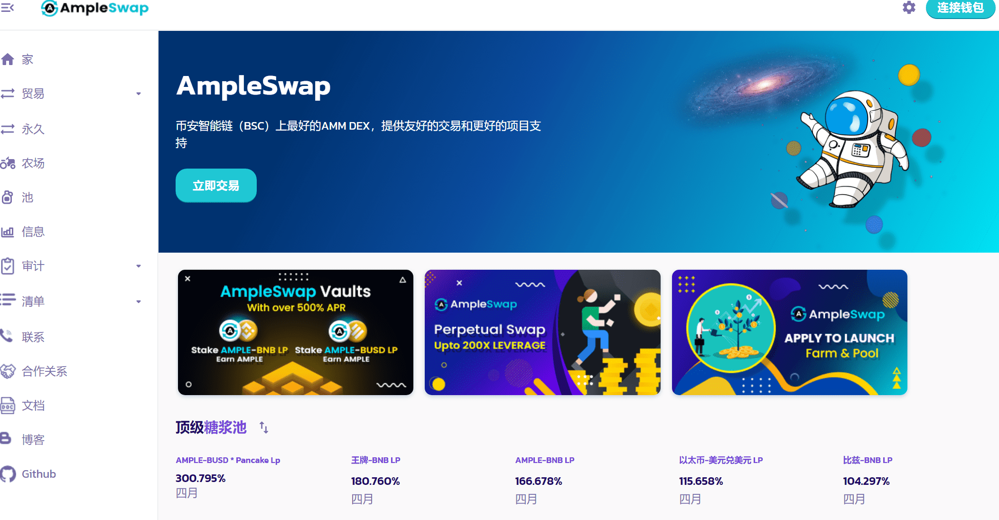
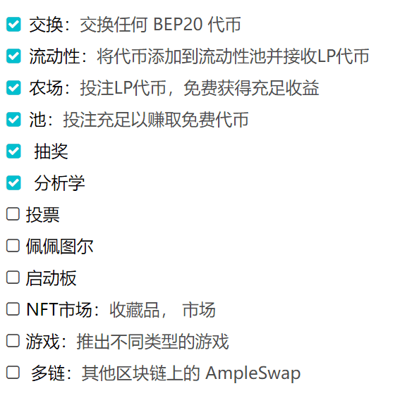

# AmpleSwap

## AmpleSwap

币安智能链（BSC）上最好的AMM DEX，提供友好的交易和更好的项目支持

---

## **AmpleSwap 介绍**

> AmpleSwap通过三种方式帮助您充分利用您的加密货币：
> 交易，赚取和获胜。

## **贸易**

> 即时交换加密令牌：无需注册或帐户。

**人民的选择**

AmpleSwap是币安智能链上最大的去中心化交易所之一，市场上的交易量（来源：1 2）。

**低廉的费用**

为什么要支付更多费用？AmpleSwap在Binance Smart Chain上运行，Binance Smart Chain是一种交易成本远低于以太坊或比特币的区块链。
交易费用也低于其他顶级分散式交易所，所以这对你来说是双赢的！

**分散**

直接从您的钱包应用程序进行交易。与Binance或Coinbase等中心化交易所不同。

## **赚**

> 以超高利率免费赚取AMPLE和其他代币。

**使用矿池赚取代币**

投注充足，赚取免费代币。就是这么简单。AMPLE持有者现在每周从重大项目中赚取价值数千万美元的免费代币。每天都有新的项目加入派对，所以你可以赚得更多，甚至更长时间。

**通过收益农场赚取丰厚收益**

投注LP代币，赚取充足收益。与矿池相比，您承担的市场波动风险略高，但可以获得更高的APR来抵消风险。

**赚取交易费用**

没有农场？没关系。即使您的交易对在农场页面上不受支持，当您将代币存入流动性池（LP）时，您仍然可以赚取交易费用。

## 赢

> AmpleSwap让赚钱变得有趣。

**抽奖**

数以千计的美元经常在AmpleSwap彩票上抢夺。加入多达1，000名每日玩家，有机会赢得大奖！

---

## 路线图

> 我们的愿景是帮助更多 Ample 项目成长为摇滚明星，我们将努力实现这一目标。这是待办事项列表

