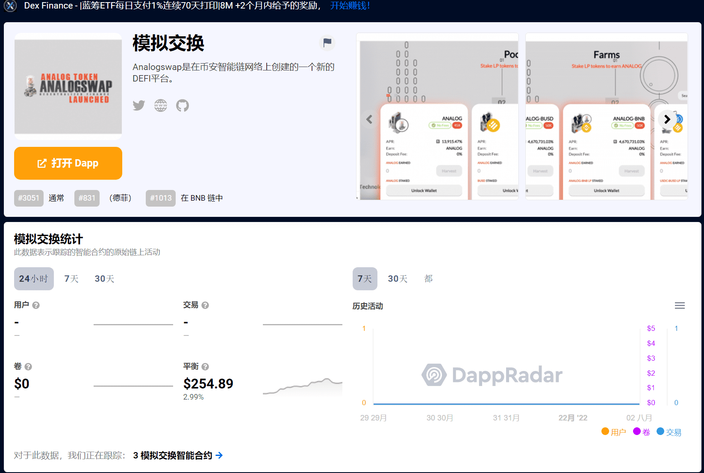

# Analogswap

## 关于使命

Analogswap 是在币安智能链网络上创建的新 DEFI 平台，旨在探索基于信任和具有高潜力的不断发展的技术创建的生态系统中的去中心化金融空间。
单产农业可能是 2020 年去中心化金融 (Defi) 爆炸的最大驱动力。风险承受能力强的投资者看到了单产农业的潜力，并抓住了用他们的加密货币赚取“免费”利息的机会。
Analogswap 使用智能合约的创新技术，本质上是自动执行在区块链上运行的编码合约。 随着技术的发展，单产农业已经成为一种投资策略。
保持简单，这就是为什么我们的团队使命是保持项目简单而有利可图，而不是让事情过于复杂！ 没有收获锁、税费或任何其他疯狂的功能来攫取投资者的钱并浪费它。
注重投资者体验。

