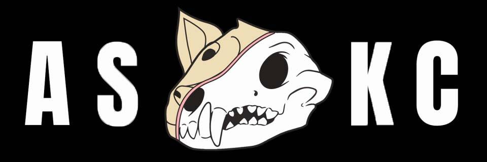

# Anatomy Science Kennel Club

解剖学养犬俱乐部

第一个受 BAKC 启发的项目，现在隐身启动，前 1000 个免费 @ 3/txn！

https://anatomysciencekennelclub.com/#

居住在 ETH 区块链上的 6,000 个解剖学拆卸的犬舍。不隶属于 ASAC 或 BAYC！立即让您的同伴作为 ERC-721A 代币生活在以太坊区块链上！

过去 7 天内没有出售解剖学科学养犬俱乐部。

立即让您的同伴作为 ERC-721A 代币生活在以太坊区块链上！

解剖科学养犬俱乐部于 2022 年 2 月 7 日首次成立。

我们目前正在追踪流通中的 5,997 个解剖学科学犬舍俱乐部代币，这些代币尚未被销毁或质押。

我们为 Anatomy Science Kennel Club 索引了 183 个独特的特征对。

购买 Anatomy Science Kennel Club 最常见的地方包括 OpenSea 和 LooksRare 等市场或 Gem.xyz 和 Genie.xyz 等聚合器。链接可以在上面找到！

