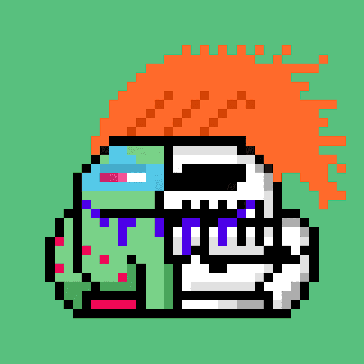

# Anatomy xToadz

Anatomy xToadz - 有没有想过 LSD 上的 CrypToadz 里面是什么？生成的加密货币将捐赠给乌克兰。

2,222 Anatomy xToadz 启发了 LSD 上的原始 CrypToadz。 这个项目是cc0，你可以用它做任何你想做的事情。 我们热爱艺术，并希望在为公益事业提供帮助的同时为您带来令人惊叹的艺术。 通过该项目产生的加密货币将捐赠给乌克兰。

▶ 什么是 Anatomy xToadz？

Anatomy xToadz 是一个 NFT（不可替代令牌）集合。存储在区块链上的数字艺术品集合。

▶ 存在多少 Anatomy xToadz 代币？

总共有 496 个 Anatomy xToadz NFT。目前，85 位所有者的钱包中至少有一个 Anatomy xToadz NTF。

▶ 最近卖出了多少 Anatomy xToadz？

过去 30 天内售出了 0 个 Anatomy xToadz NFT。

