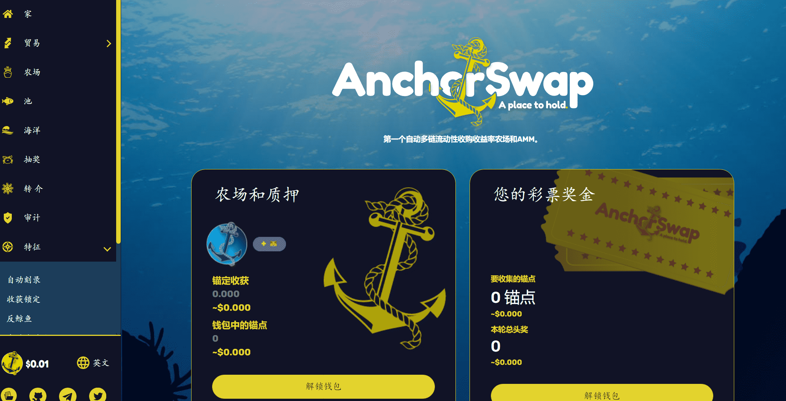

# AnchorSwap

AnchorSwap 是一个运行在币安智能链上的自动流动性获取收益农场和 AMM 去中心化交易所，具有众多创意功能，让用户通过质押获得高 APY。 AnchorSwap 是公平启动的，没有预售，没有迁移代码，并且不受闪贷攻击。 AnchorSwap 完全支持 CAKE-LP v2 质押。 AnchorSwaps 的创新功能包括 Anti Wale 措施、自动流动性、Harvest Lockup、Auto-Burning、Referral Program、Timelock 和 Anti Flash Loan Attack 机制。 

---

## 介紹

AnchorSwap是一個分散的交易所和自動流動性收購收益農場，目前在Binance Smart Chain上運行，其願景是將來在其他幾個區塊鏈上推出。我們創建了一個名為Anchor的通貨緊縮令牌，它允許具有足夠燃燒機制的恆定價格泵。我們每天都在農場和游泳池中增加鎖定價值。這種高價值直接流入系統，併為用戶創造了一個可持續的環境，以高APR生產農場，交換最新的代幣並使用最好的可用技術。

## 主要特點

**自動流動性**

每次轉讓ANCHOR代幣必須支付2.5%的轉讓稅。該稅的2%將自動添加到ANCHOR流動性池中，從而對ANCHOR代幣價格產生積極影響。自動流動性被鎖定在智能合約中，無法訪問。

**自動燒錄**

如前所述，每次轉讓ANCHOR代幣必須支付2.5%的轉讓稅。2%的轉讓稅分配給自動流動性。剩餘高達0.5%，將立即自動燃燒。

**收穫鎖定**

收穫鎖定是一種專為農業獎勵而設計的鎖定機制。這是一個防禦功能，限制收穫的頻率，以防止農業套利機器人不斷收集獎勵並傾倒它們。

**無遷移者代碼**

代碼開發人員可以移動您的LP令牌。我們已經刪除了他，所以沒有人可以用LP令牌做任何事情。

**時間鎖**

已向 ANCHOR 令牌啟動添加了一個時間鎖。

**社區驅動**

AnchorSwap-Token和圍繞Anchor的整個環境是一個社區驅動的專案。社區將討論有關功能，新池，新農場，最新令牌和更新的許多決定。該社區還可以為下一個功能投票。

## 路線圖

> 如您所見，我們正試圖為每項任務提供ETA。但開發或編碼並不容易，而且總是伴隨著一些不確定性。我們將盡最大努力按時發佈每個功能或產品。另請注意可能的延誤。

