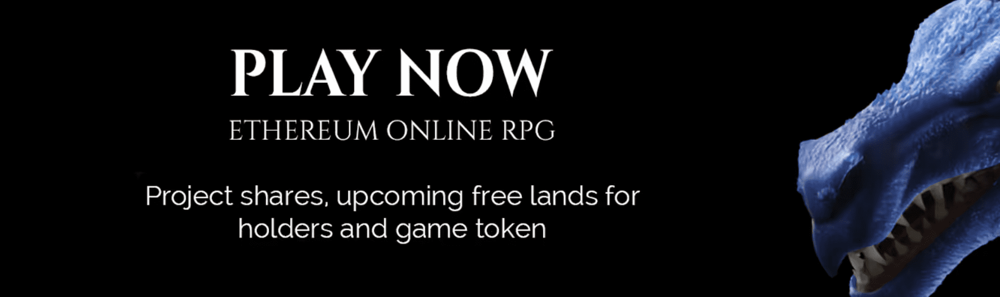

# Ancient Dragons Gen1

Ancient Dragons Gen1 NFT 在过去 7 天内售出 2 次。Ancient Dragons Gen1 的总销售额为 109.78 美元。一个 Ancient Dragons Gen1 NFT 的平均价格为 54.9 美元。有 148 位远古巨龙 Gen1 拥有者，总共拥有 280 个代币。

当前供应量：333 - 最大供应量：444 - 53 在项目保险库中用于赠品

##### ▶ 什么是远古巨龙 Gen1？

Ancient Dragons Gen1 是一个 NFT（不可替代代币）集合。存储在区块链上的数字艺术品集合。

##### ▶ 存在多少个远古巨龙 Gen1 代币？

总共有 280 个远古巨龙 Gen1 NFT。目前 148 位所有者的钱包中至少有一个 Ancient Dragons Gen1 NTF。

##### ▶ 最昂贵的远古巨龙 Gen1 销售是什么？

最贵的远古巨龙 Gen1 NFT 是 [远古巨龙](https://www.nft-stats.com/asset/0xf9266d77ba833ae3d3d06581983c8cb5a48da6be/79)。它于 2022-06-10（2 个月前）以 87.6 美元的价格售出。

##### ▶ 最近卖出了多少古龙Gen1？

过去 30 天内售出了 6 个远古巨龙 Gen1 NFT。

##### ▶ 什么是流行的远古巨龙 Gen1 替代品？

许多拥有 Ancient Dragons Gen1 NFT 的用户还拥有 [After-Death](https://www.nft-stats.com/collection/afterdeath-p2e)、 [Genesis TWD](https://www.nft-stats.com/collection/walking-dood)、 [3LUE](https://www.nft-stats.com/collection/blueorigin-art)和 [MetaverseRiders](https://www.nft-stats.com/collection/metaverseriders)。

