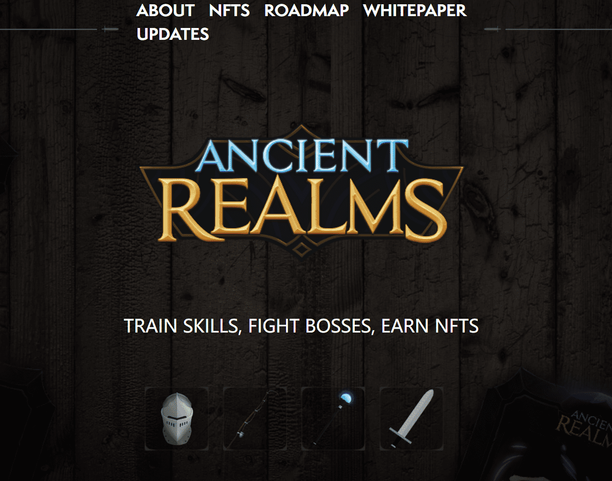

# Ancient Realms

## 关于游戏

Ancient Realms 是一款通过游戏赚取的增量 RPG，您可以在其中使用武器和装备 NFT！ 装备你的 NFT 并获得齿轮分数奖励，这将帮助你训练你的战斗等级、击败怪物或与老板战斗！ 要与首领战斗，您需要支付金币费用，而击败区域首领将使您有机会通过我们的智能合约在区块链上铸造强大的新物品。

**工具和代币**
通过在游戏中装备 NFT 工具，您将您的 NFT 质押到我们的合约中，让您可以在工具稀有度级别挖掘相应的货币。 有两种类型的工具； 钓鱼竿和镐。 钓鱼可以为您赚取 FISH，它可以治愈您，而镐则可以为您修理装备赚取 IRON。

**战斗**
装备你的武器和盔甲 NFT 来增加你的装备分数！ 你的齿轮分数越高，你能对付的怪物就越强。 通过选择最佳风险回报率来最大化您的效率。 训练你的近战、远程或魔法属性，成为该领域最强大的广告商！

**boss和掉落boss**
地图的每个区域都有自己的boss，可以掉落具有强大统计数据的独特 NFT。 您不仅需要高齿轮分数，而且还需要支付 GOLD 费用才能访问区域老板。 各地区的杰出成员，Boss 是一名凶猛的战士，会对您的护甲和健康造成重大伤害，需要 FISH 和 IRON 才能补充。
