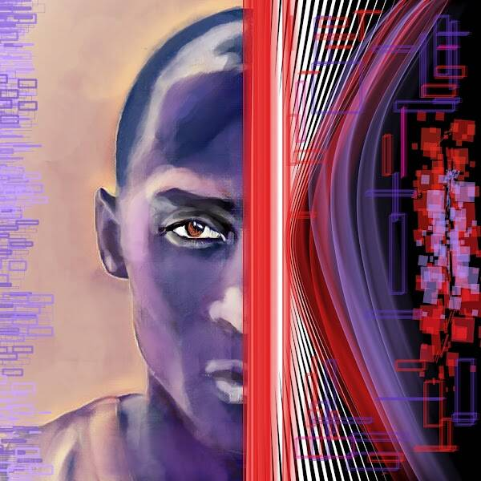

# Android by Andreea Gabriela

使用@manifold 创建

Android 是 Andreea aka IconicShapes 的第一个数字表达，代表了她从传统艺术到数字艺术的转变。

30 个版本，共 5 个，5000x5000 像素 - JPG

你好！我是安德烈亚·加布里埃拉。 
使用混合媒介的视觉艺术家
通过我的画作讲故事

▶ Andreea Gabriela 的 Android 是什么？

Andreea Gabriela 的 Android 是一个 NFT（不可替代令牌）集合。存储在区块链上的数字艺术品集合。

▶ Andreea Gabriela 的 Android 代币有多少？

Andreea Gabriela NFT 总共有 10 个 Android。目前 4 位所有者的钱包中至少有一部 Andreea Gabriela NTF 的 Android。

▶ Andreea Gabriela 最近卖出了多少台 Android？

在过去 30 天内售出了 0 个 Andreea Gabriela NFT 的 Android。

