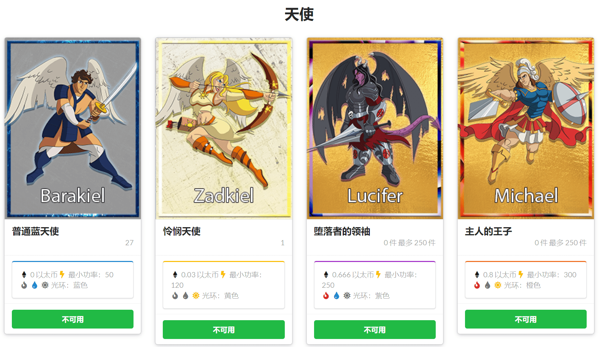
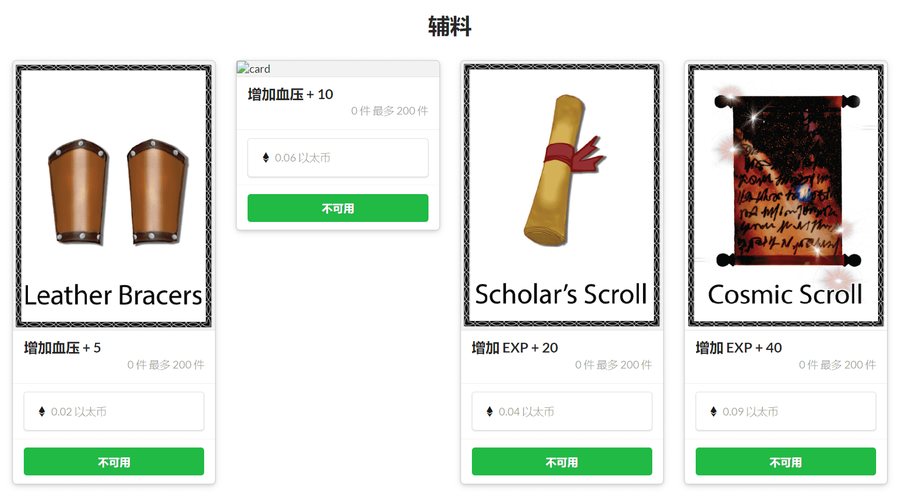
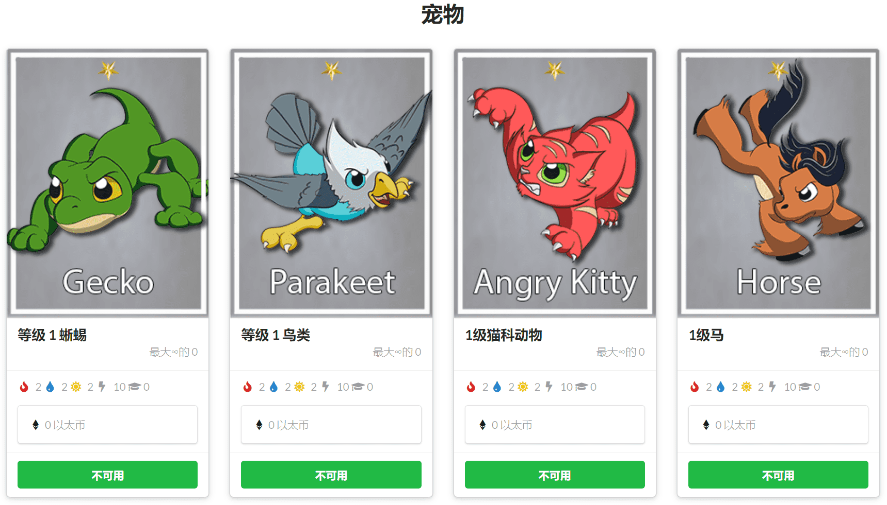

# Angel Battles

## 介绍

Angel Battles是一个建立在以太坊区块链上的分散式应用程序。

收集天使卡、宠物卡和附属卡牌，训练、繁殖和战斗，登上全球排行榜锡安山的顶端。市场将玩家与时间，精力，技能和运气联系起来，以培养强大的天使和宠物，以及那些希望尽快达到精英地位的人。

> 这是历史网站，版本2作为免费的，激励性的测试版上线
>
> 天使之战于2018年1月推出首份合约。ERC721标准处于起步阶段，我们的第一个合同并不完全兼容（我们使用解锁而不是批准）
>
> 我们在dappradar上达到了DAU的前5个Etherum游戏，但在高昂的汽油费环境中，游戏的复杂性是不可持续的。
>
> 该游戏正在积极开发中（自2021年春季以来），我们正在测试几个汇总和其他扩展解决方案。

