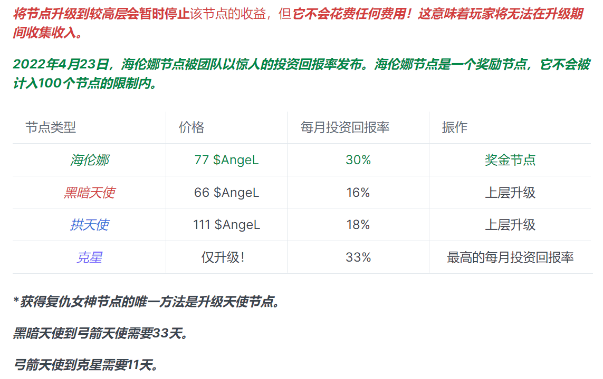
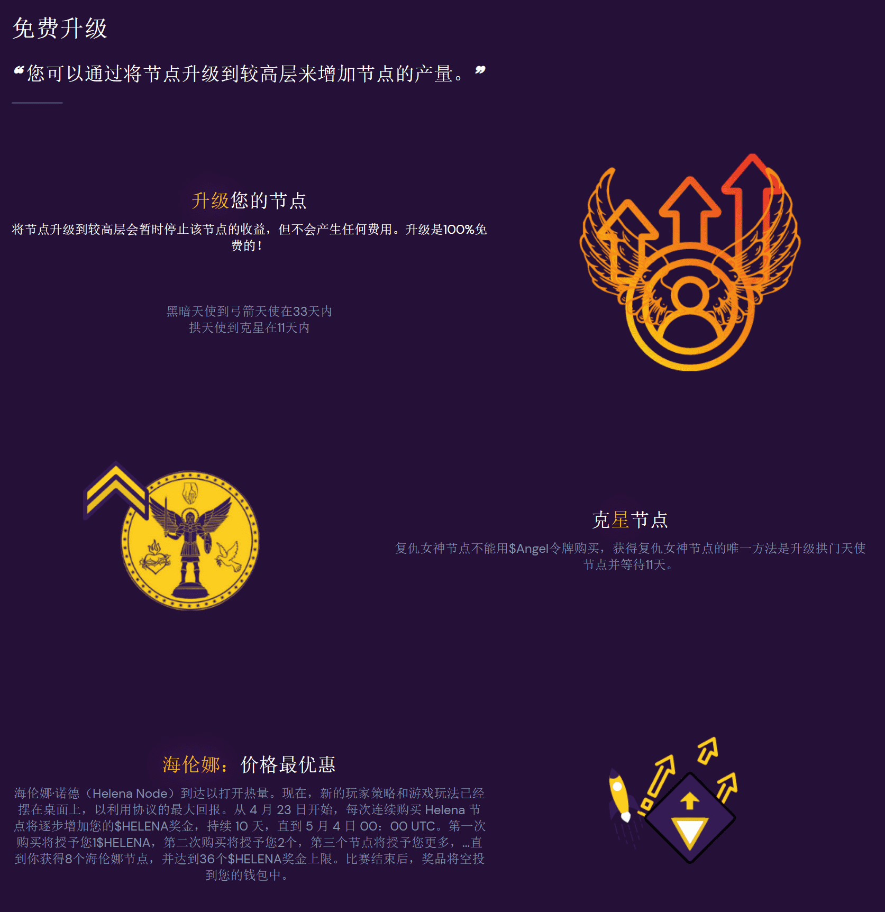

# AngeL Nodes

## 什么是Angel Nodes

“Angel Nodes”，一种带来可持续收益的 DeFi 质押游戏，旨在为任何人打开 DeFi 未来的大门。该协议将促进未来的发展，为社区提供可持续的 Defi 即服务。我们的协议为您提供了一个节点生态系统，您可以在其中创建自己的节点以产生终生的被动收入。节点持有者将通过我们的原生代币 $AngeL 获得奖励。
我们将提供一个长期可持续的环境，以激励长期投资。收益将根据您的节点类型按比例进行耕种和重新分配。协议变量可能随时间随行业条件而变化，以确保协议的健康。但是，所有收益将始终在这些节点上分配回，这些节点充当收益篮子，创造了终生的被动收入来源。
对于每个节点，您购买都会收到 $AngeL 形式的每日奖励。天使节点充当收益篮子，根据奖励池向您支付奖励。
奖励池可以来自各种收益农场服务和投资者注入。为了让每个人都能负担得起节点，我们创建了一个灵活的节点系统。

## 节点类型和升级

每个钱包的最大节点数限制为100。

AngeL节点为您提供一个生态系统，以产生终身被动收入，同时加强协议的可持续增长。您可以通过将节点升级到较高层或使用助推器代码来提高节点的产量。

- 玩家不必每天索取他们的收入。节点收益堆积如山。

- 分布不是即时的，并且是按顺序进行的。可能需要1小时到12小时才能收到收集的节点收入，但是玩家在此等待期间继续收集收入。

  

## 游戏特色

