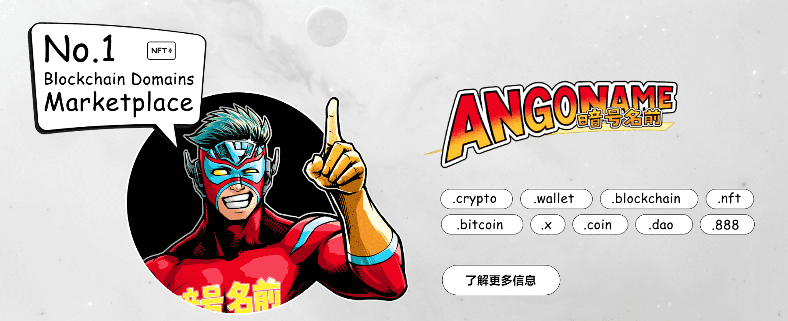

# Angoname

## 什么是Angoname

Angoname 是区块链域名的去中心化二级市场，用户可以在其中购买和出售他们的域名。 此处的这些区块链域将加密货币地址替换为人类可读的名称。

巴科公司已将Angoname设计为**独家二级区块链域名市场。**

简而言之，用户可以直接在Angoname上购买和转售流行的区块链域名***，如.crypto，.coin，.wallet，.bitcoin，.blockchain，.x，.nft，.dao***等。

在域名搜索结果页面上，Angoname会将来自原始提供商的所有结果显示为不可阻挡的域名，以显示来自独立零售商的结果。

Angoname也是完全分散的，因为用户开始交互所需的一切都是在没有任何事先注册的情况下使用以太坊钱包登录。
