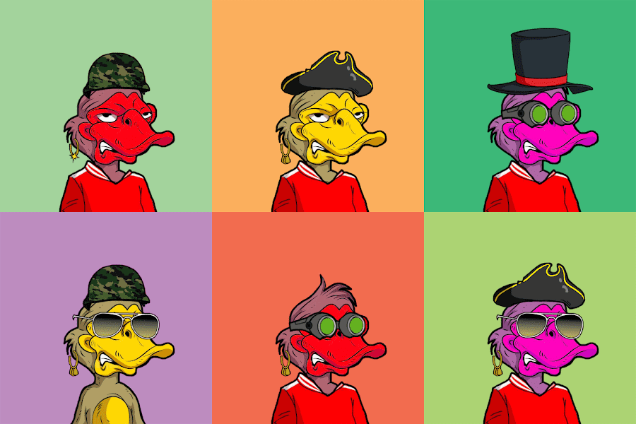

# Angry Ducklings

愤怒的小鸭来了！这一一次性销售包括 333 只愤怒的小鸭，它们刚刚被踢出池塘。给他们一个新家，今天就买一个。拥有一只小鸭可以授予所有者对 NFT IP 的完全货币化权利，以及访问全球 NFT 爱好者社区的权限。

▶ 什么是愤怒的小鸭？

Angry Ducklings 是一个 NFT（Non-fungible token）集合。存储在区块链上的数字艺术品集合。

▶ 愤怒的小鸭代币有多少？

总共有 301 个愤怒的小鸭 NFT。目前，152 位车主的钱包中至少有一个 Angry Ducklings NTF。

▶ 最近卖了多少愤怒的小鸭？

过去 30 天内共售出 0 个 Angry Ducklings NFT。

