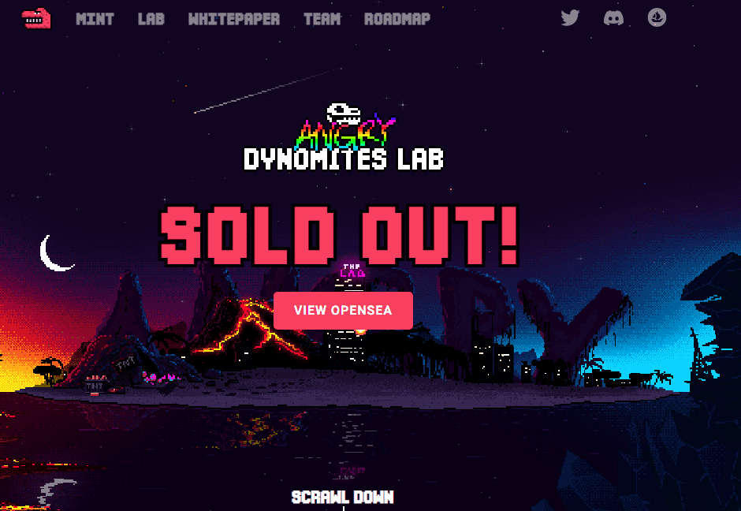

# Angry Dynomites Lab

**《愤怒的Dynomites Lab》**是世界上第一款大型多人合作游戏。玩家需要<strong>联合</strong>建造神器来帮助可怜的Dynomites生存。创造这些所谓的杰作需要许多材料，这使得单个玩家不可能独自建造它们。因此，社区需要<强>合作</强>建立繁荣，分散经济由生活在区块链上的代币提供动力。玩家需要制作材料，建立生产线，与他人进行贸易

## 大型合作多人游戏**遇上**经济模拟游戏**遇上**区块链

Angry Dynomites Lab是世界上第一**款在区块链上的大型合作多人游戏**。玩家需要**团结起来**建造神器，以帮助可怜的迪诺米特人生存。制作这些所谓的杰作需要许多材料，因此不可能单独为单个玩家构建它们。因此，社区需要**合作**建立一个由区块链上的代币驱动的蓬勃发展的**分散经济**。玩家需要制作材料，建立生产线，相互交易，并**优化他们的生产帝国**，以保持我们笨拙的Dynomites的活力。**作为经验丰富的游戏开发人员**，我们将把它打包成一个疯狂而有趣的世界 - **永远为每个人创造一个有趣的游戏。**

通过愤怒的Dynomites Lab，我们希望获得**超凡星和令人满意的核心机制，**但使它们更加休闲，并将它们放入一个疯狂的新恐龙设置中。借助区块链技术，我们可以创建一个由供需驱动的游戏经济，同时打破项目之间的界限。

**NFT将存在于以太坊主网上，ERC-20代币将存在于Polygon上**，游戏逻辑将在我们的后端运行。因此，我们有一个值得信赖的NFT链，廉价的汽油费来交换代币，并且根本没有玩游戏的汽油费。

