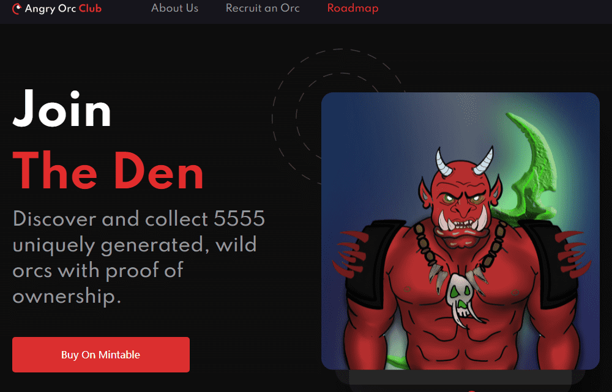

# Angry Orc Club

5555只拥有所有权证明的野生兽人。每个非ft都是一个不断增长的社区的正式会员，以及我们即将在以太坊区块链上构建的梦幻游戏的令人敬畏的实用程序。

&nbsp;

**FantasyCraft的公告**，这是一款在以太坊区块链上开发的游戏，您可以在其中与对手的对手派系作战。甚至可以与自己的派系进行友好决斗，以获得经验并有机会获得小奖品。这些将比在战争中与敌人进行的决斗风险更低。这些决斗将面临更大的利害关系，但战利品将更大。市场生产将从你能够交易单个盔甲的地方开始，每个盔甲都有自己的统计优先级。

5555个独特生成的野生兽人，带有所有权证明。每个NFT都拥有不断增长的社区的正式会员资格，并为我们即将推出的基于以太坊区块链的幻想游戏提供了很棒的实用程序。

