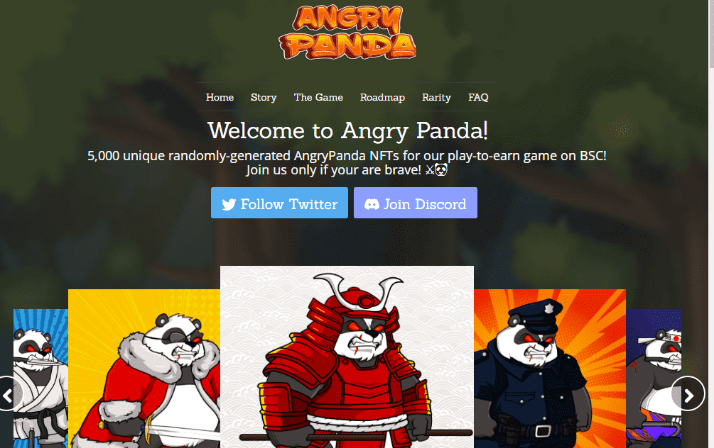

# Angry Panda

超级通货紧缩;可持续模因代币与顶级代币经济学&特性。愤怒的熊猫在一个代币中提供了最好的利益。💰24/7自动抽奖💰每周#空投💰自动#奖励🔥超通货紧缩🔥#回购&燃烧🔥周期性燃烧- 15%💧汽车流动性🔶#NFTs与用例即将到来

##### 愤怒的熊猫 v1.0

> 愤怒的熊猫是一个新的游戏赚取游戏，允许NFT持有者每天赚取BNB。

> 只有NFT持有者才能玩游戏，并且将为每个NFT设置每日游戏的最大数量。

> 出于这个原因，我们将NFT的数量限制在5，000个，以奖励持有者并提高二级市场的最低价格。

首先，愤怒的熊猫是币安智能链上5，000个随机生成的NFT的集合，具有长远的眼光和二级市场导向。

其次，这是一个新的游戏来赚取区块链NFT游戏，允许ANGRYPANDA持有者每天赚取BNB。

每个NFT都是随机生成的，具有数百种特征，特征，...

有关更多详细信息，请查看我们的稀有度图表。

