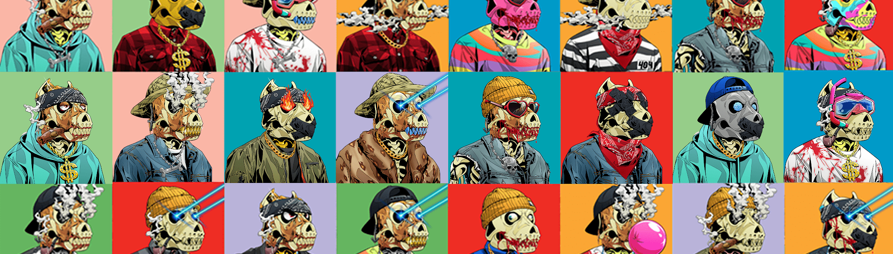

# Angry Pitbull Club Polygon

10,000 只愤怒的比特犬的集合。愤怒的比特犬俱乐部是 10,000 个独特的数字比特犬 NFT 收藏品的集合，它们通过所有权代表社区。愤怒的斗牛犬以 ERC-721 代币的形式存储在以太坊区块链上。

Angry Pitbull Club NFT 在过去 7 天内售出 33 次。Angry Pitbull Club 的总销售额为 4.68 万美元。一份 Angry Pitbull Club NFT 的平均价格为 141.9 美元。有 4,979 名 Angry Pitbull 俱乐部所有者，拥有 10,000 个代币的总供应量。

##### ▶ 什么是愤怒的比特犬俱乐部？

Angry Pitbull Club 是一个 NFT（非同质代币）集合。存储在区块链上的数字艺术品集合。

##### ▶ 存在多少愤怒的比特犬俱乐部代币？

总共有 10,000 个 Angry Pitbull Club NFT。目前，4,979 位车主的钱包里至少有一个 Angry Pitbull Club NTF。

##### ▶ 最昂贵的 Angry Pitbull Club 销售是什么？

出售的最昂贵的 Angry Pitbull Club NFT 是 [Angry Pitbull 2954](https://www.nft-stats.com/asset/0x05fee3b8e939acbb4e8073d784e3ec0977509770/2954)。它于 2022-06-24（大约 2 个月前）以 768.5 美元的价格售出。

##### ▶ 最近卖出了多少愤怒的比特犬俱乐部？

过去 30 天内售出了 141 个 Angry Pitbull Club NFT。

##### ▶ 愤怒的比特犬俱乐部要多少钱？

在过去 30 天内，最便宜的 Angry Pitbull Club NFT 销售额低于 120 美元，最高销售额超过 236 美元。过去 30 天 Angry Pitbull Club NFT 的中位价格为 149 美元。

##### ▶ 有哪些流行的 Angry Pitbull Club 替代品？

许多拥有 Angry Pitbull Club NFT 的用户还拥有 [DentedFeelsNFT](https://www.nft-stats.com/collection/dentedfeelsnft)、 [CryptoCaveClub](https://www.nft-stats.com/collection/cryptocaveclub)、 [The Coffee Junkies](https://www.nft-stats.com/collection/coffeejunkies)和 [Chains NFT](https://www.nft-stats.com/collection/chainsnft)。

